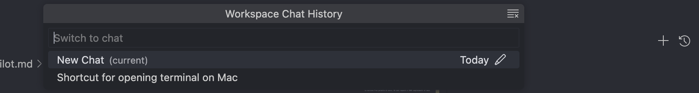
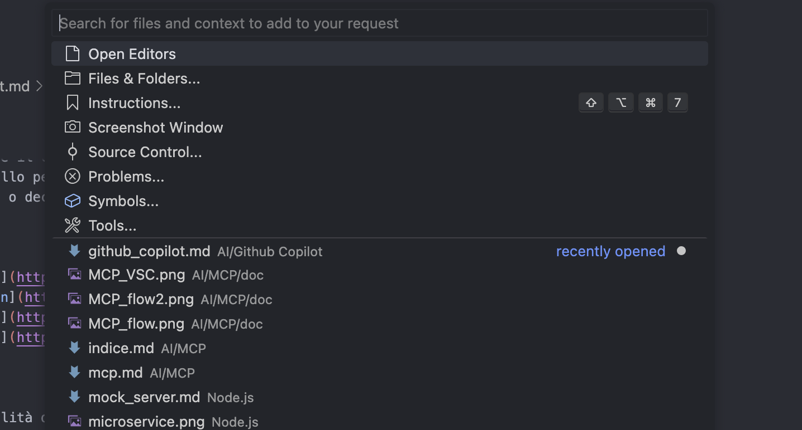
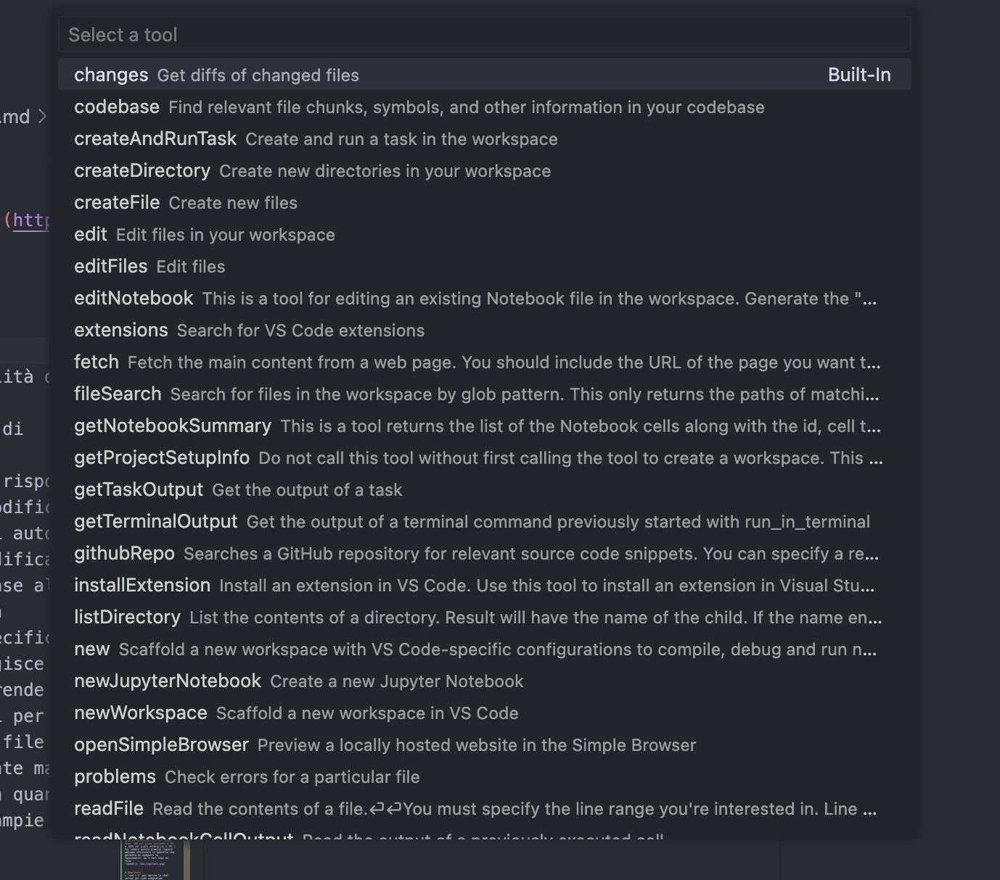
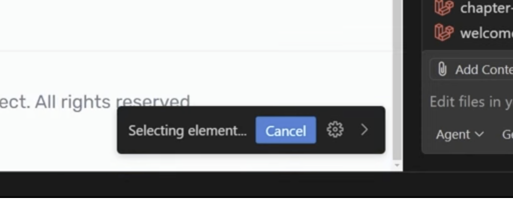
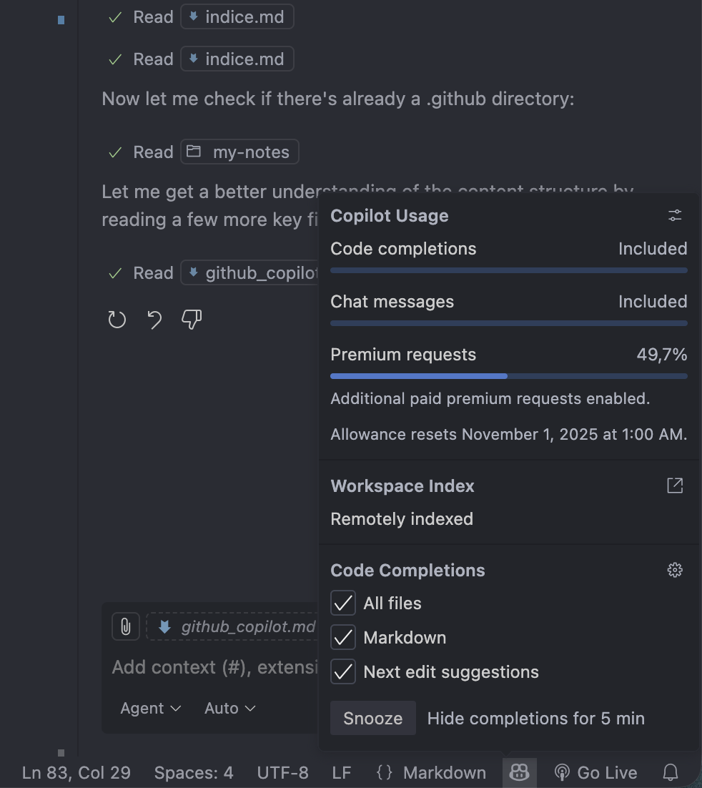
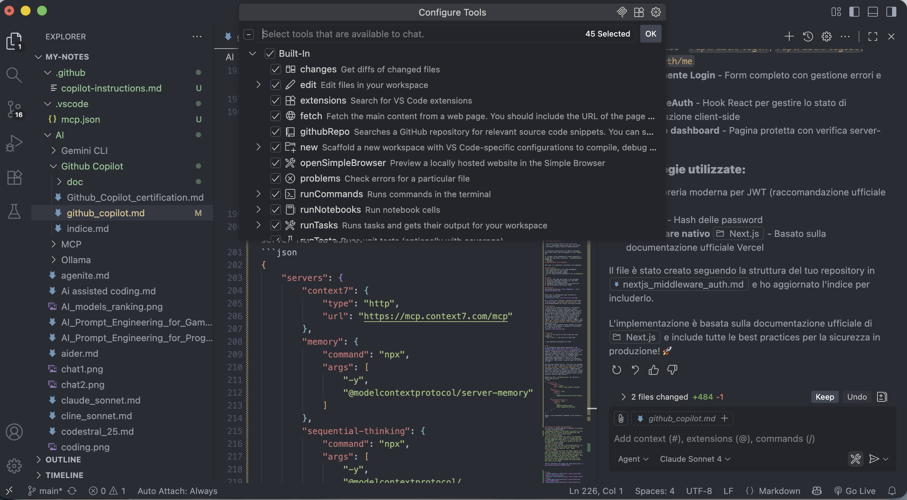

# Github Copilot

E' un Ai coding assistant che permette di scrivere codice velocemente e con meno sforzo. L'idea è quella che sia un aiutante e non il pilota dell'aereo, quindi verificare sempre le risposte che produce e editare il codice secondo il seguente ordine di modifica:
- **ghost text**
- **inline chat**
- **chat panel**

 La versione Free permette di avere, 50 chat requests e 2000 completamenti al mese.


## 1. Code completion
Inserendo un commento o semplicemente attendendo si possono ricevere suggerimenti (code completion as ghost text) che possono essere accettati premendo `TAB`. Nota bene anche il code completion può essere pensata come una query del tipo: 
```text
you are a code completion agent. The current file you have to complete is {file}, the language of the file is {language}. Return the result as a plain text without the "". Finish the following code snippets  {{prefix}}[MARKER]{suffix}} . Only return the exact replacement for the marker. Do not return multiple suggestions
```
## 2. Inline Chat
Premendo `cmd + I` si può avere una chat inline che permette di avere un'interazione più veloce con Copilot e limitata alla porzione di codice ed al file che sto editando (`ESC` per chiudere tale chat inline) _ed è consigliata rispetto ad inserire un commento ed aspettare l'autocompletamento_. Inoltre usare inoltre la feeback e rating feature (i btn per dare un voto ai suggerimenti) per migliorare la qualità dei suggerimenti nel tempo.

## 3. Chat
Tramite la chat in basso è possibile:
- **si può avere più hat session alla volta** (ES: una per coding e una per brainstorming)


- chattare (anche oralmente premendo il microfono) sul codice del file corrente o fare domande generiche (`Puoi darmi 15 React interview questions and answers`) 
- chiedere a copilot di eseguire dei task come `create a fancy login form` ed indicare cambiamenti usando il linguaggio naturale oppure `regex to match the phone number in the format (xxx) xxx-xxxx`.
- allegare file di contesto
- usare i `participants` scrivendo nella chat il carattere `@`. Questi permettono di specificare il contesto in cui si vuole lavorare ed eseguire azioni.

### [Participants](https://code.visualstudio.com/docs/copilot/getting-started-chat#_use-chat-participants)
Potrei scrivere nella chat `Qual'è lo shortcut per aprire il terminale?` e copilot andrebbe online per trovare la risposta ma correttamente si dovrebbe usare `@vscode qual'è lo shortcut per aprire il terminale sul mac?`, oppure `#terminal top ten git command` se si vuole avere informazioni sul terminale di VSC o `@workspace` se si vuole avere informazioni sul workspace (tutti i file del progetto).

### @workspace
E' sempre bene specificarlo nella chat se invece di fare domande generiche si vuole fare domande esclusivamente al contesto del progetto. Ad esempio:
`@workspace create a new component in src/features/products to manage CRUD operation on products`. oppure `@workspace where is the AuthComponent referenced`.

Notare che è possibile riusare dei prompts usando la UP ARROW e DOWN ARROW per navigare tra i precedenti messaggi.

### Shortcuts
per non rieseguire lo stesso task si usano gli **slach command** _sottolineando il codice_ ed inserendo `/` per poi avere una lista di comandi disponibili. Ad esempio:
 - `/doc` per documentare il codice,
 - `/edit` per modificare il codice, 
- `/explain` per spiegare il codice,
- `/fix` per correggere il codice,
- `/generate` per aggiungere codice,
- `/test` per testra eil codice,

Notare che premendo `/` nella chat si possono avere + comandi rispetto all'inline chat, come ad esempio `/new` che permette di creare un nuovo file o `/clear` che pulisce la history della chat.


### Modify & Review
Una volta che si sottolinea del codice appare una icona che se cliccata apre una dropdown con due opzioni:
- `Modify` per modificare il codice selezionato -> apre l'inline chat
- `Review` apre un pannello per revisionare il codice selezionato con la possibilità di accettare o declinare i suggerimenti


## Modes
Github Copilot ha 3 modalità di funzionamento:
- **Ask mode**: permette di chattare con l'AI, fare brainstorming, e dà solo risposte come "proposte" ma non modifica il codice e prende decisioni autonome.
- **Edit mode**: l'ai modifica anche file multipli in base alle richieste dell'utente con modifiche contenute e specifiche.
- **Agent mode**: l'AI agisce come un agente autonomo che prende decisioni e compie azioni per conto dell'utente su più file e contesti. E' il più potente ma anche il più rischioso in quanto l'AI può fare modifiche ampie e non sempre desiderate.

E' possibile definire anche [Custom Chat Mode](https://code.visualstudio.com/docs/copilot/customization/custom-chat-modes) per creare modalità personalizzate con regole specifiche.

## Context
Per contesto si intendono le informazioni che l'AI utilizza per generare risposte pertinenti.

Il **context window** è la quantità massima di informazioni che l'AI può considerare in una singola interazione: per le inline completions vengono usati 8k tokens (circa 6.000 parole) mentre per la chat dipende dal modello.

Tutti i messaggi della chat vengono messi nel contesto questo porta a saturare il contesto velocemente. Per questo è possibile usare il comando `/clear` per resettare la chat e liberare il contesto.

 In Github Copilot **per tutti e tre i modi** il contesto può essere fornito in diversi modi:
- il tab corrente è automaticamente aggiunto al contesto della chat
- è possibile usare i participants per specificare il contesto (es. `@workspace`, `@vscode`, `#terminal`)

Cliccando la graffetta si apre il pannello

- è possibile allegare file o cartelle di contesto alla chat tramite drag and drop
- Screenshot possono essere allegati alla chat
- Tools: si possono usare strumenti come
    
    - fetch per prendere il contenuto di una pagina 
    - codebase (per indicare l'intera codebase del progetto)
    - githubRepo per prendere informazioni da un repo github
Notare che tutti i tool possono essere usati scrivendo `#toolname` nella chat (es. `#fetch https://example.com`)

## Simple Browser
E' un browser incluso in VSC che può dare contesto alla chat di copilot. Per aprirlo:
- aprire la command Palette (`cmd + shift + P`)
- Sceglire: Simple Browser (show), mettere l'url e premere invio
- Premere nella finestra "Add element to chat" per aggiungere degli elementi come contesto alla chat
    

## Instruction files
Per aggiunere contesto ed istruzioni specifiche **a tutte le chat di un progetto** si possono usare dei file di istruzioni speciali. 

1. Istruzioni globali per tutto il repository: `.github/copilot-instructions.md` 
Questo è il file principale per dare a Copilot contesto su:
- Stack tecnologico e dipendenze del progetto
- Convenzioni di codice (es. double quotes per JS, Bazel per Java)
- Comandi di build, test e deploy
- Architettura e struttura delle directory

```markdown
# Copilot Instructions

## Tech Stack
- Backend: Node.js + Hono framework
- Frontend: Angular 20 + TypeScript
- Database: SQLite + Drizzle ORM
- Testing: Playwright per E2E

## Coding Standards
- Usa sempre TypeScript strict mode
- Preferisci async/await invece di Promise chains
- Scrivi test unitari per ogni service
- Usa double quotes per stringhe JavaScript

## Build Commands
- `pnpm install` per installare dipendenze
- `pnpm build` per compilare
```
2. Istruzioni specifiche per path: `.github/instructions/NAME.instructions.md`
```markdown
---
applyTo: "src/backend/**/*.ts"
---

# Backend Instructions

- Tutte le API devono avere validazione degli input con Zod
- Usa sempre try/catch per gestione errori
- Log ogni richiesta HTTP con winston
- Implementa rate limiting per endpoint pubblici

```
```markdown
---
applyTo: "src/app/**/*.component.ts,src/app/**/*.component.html"
---

# Frontend Instructions

- Usa OnPush change detection per performance
- Tutti i componenti devono avere test con TestBed
- Usa Angular signals invece di BehaviorSubject

```
3. Istruzioni universali per AI agents (standard multi-tool) nella root del progetto in file `AGENTS.md`

4. I prompt files permettono di creare template di prompt per operazioni ripetitive  `.github/prompts/*.prompt.md`
```markdown
# Generate React Form Component

Your goal is to generate a new React form component.

## Requirements
- Use `react-hook-form` for state management
- Use TypeScript for type safety
- Include Zod validation schema
- Use our design system components from `@/components/ui`

## Steps
1. Ask for form name and fields if not provided
2. Generate TypeScript interface for form data
3. Create Zod validation schema
4. Implement form component with react-hook-form
5. Add accessibility attributes (ARIA)

## Reference
See design system docs: [Form Component](../docs/design-system/Form.md)
```

Nella chat si indicheranno come reference le istruzioni utilizzate


Se si clicca sulla rotelina è possibile selezionare la voce di menu __Generate Agent Instruction__ che crea automaticamente un file di istruzioni di base.

## Multipliers
- coso sono le premium multipliers? i multipliers (moltiplicatori) servono a determinare quante "premium requests" vengono consumate ogni volta che si utilizza un determinato modello AI. Ogni modello ha un premium request multiplier che rappresenta la quantità di risorse computazionali necessarie per servire una richiesta: modelli più potenti hanno moltiplicatori più alti, poiché consumano più capacità del sistema rispetto a modelli leggeri. **1× indica una richiesta premium standard** (50 nel piano free, 300 nel piano business a 19€ e 1000 nel piano enterprise a 39€ )
Per vedere quante premium request abbiamo utilizzare il pannello che permette di spegnere la funzionalità su i vari tipi di file:



# Shortcuts
- `cmd + I` per aprire la chat inline per code completion
- `cmd + ctrl + I` per aprire la chat panel


- come impostare checkpoints di chat?


# MCP
E' un protocollo open source annunciato il [25 Novembre 2024 da Anthropic]((https://www.anthropic.com/news/model-context-protocol)) che permette in una modalità standardizzata di fornire contesti ai LLM, ossia tool esposti da server che possono essere consumati da client (scritti in linguaggi diversi da tali server). L'idea è quella di fornire delle connessioni bidirezionali e sicure tra le AI applications (MCP Client) e i server che espongono funzionalità (MCP Server), come un layer tra le APIs e i LLM.

LLM sono dei sistemi Text In / Text Out cioè prendono del testo in input e generano un output testuale **ma non hanno accesso a fonti di dati esterne**, la sola conoscenza che hanno è legata all' "addestramento" che hanno ricevuto fino ad una certa data (la `cutoff date`). Se facessimo la domanda che ore sono a Tokyo? a un LLM, esso non saprebbe rispondere perchè non ha accesso a fonti di dati esterne. 

Editare un file `.vscode/mcp.json` per definire i server MCP da usare:
```json
{
    "servers": {
        "context7": {
            "type": "http",
            "url": "https://mcp.context7.com/mcp"
        },
        "memory": {
            "command": "npx",
            "args": [
                "-y",
                "@modelcontextprotocol/server-memory"
            ]
        },
        "sequential-thinking": {
            "command": "npx",
            "args": [
                "-y",
                "@modelcontextprotocol/server-sequential-thinking"
            ]
        },
    }
}
```
Vedere i tool disponibili premendo il btn accanto al send:


Utilizzarli con (richiamandoli espressamente nel prompt):
```
Create a Next.js middleware that checks for a valid JWT in cookies and redirects unauthenticated users to `/login`. use context7
```


# Essential AI prompts for developers
Per scrivere i prompt abbiamo le seguenti 4 strategie:
- **Q&A** strategy prompt: 
`#worksppace propose a file/folder structure for this project. Ask me a series of yes/no questions that will help you provide a better answer`
- **Pros & Cons** prompt
`what are a few different ways that i can implement this db connection logic. Give me the pros and cons of each suggestion #file:db.ts` -> `rewrite the code as suggestion 2` -> `give me an example for how to use this in my application`
- **Step by step** prompt
`Help me refactor the code in #file:vehicleSrv.ts. Go one step at a time. Do not move to the next step until i give you the keywork "next". Begin` 
- **Role** Prompt
`You are a skilled instructor who makes complex task easy to understand. You came up with fun exercises so that your students can learn by doing. your goal is to teach students to be proficient with {regex}. Move one step at a time and wait for the student to provide the correct answer before you move on the next step. If the student provide the wrong answer, give them a hint. Begin`

Source: [Essential AI prompts for developers](https://www.youtube.com/watch?v=H3M95i4iS5c)


# Links
- [Github Copilot in VSC](https://code.visualstudio.com/docs/copilot/overview)
- [Official documentation](https://docs.github.com/en/copilot)
- [Coding best practices](https://www.youtube.com/watch?v=2q0BoioYSxQ)
- [@workspaces Deep dive](https://www.youtube.com/watch?v=3Yz48eenPEE)