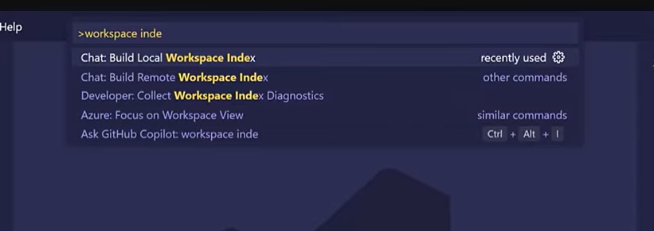
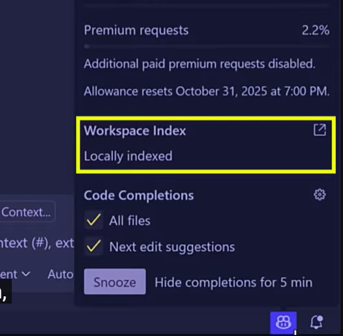
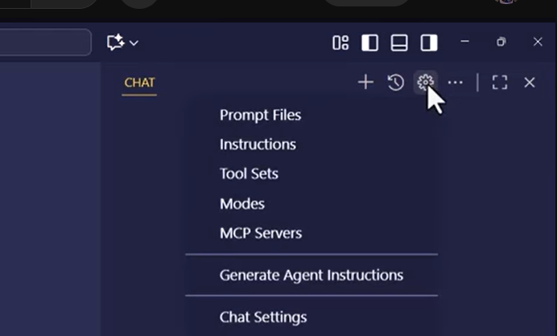

# Custom Chat Modes
Cliccando sulla combox dei modi è possibile oltre che scegliere i vari chat mode (Ask, Edit, Agent) anche crearne di nuovi selezionando "Configure Modes". L?idea è avere dei custom chat modes che definiscono specific comportamenti in base a Tool e quindi ad MCP diversi a seconda delle esigenze: 
0. Create a new chat mode
1. Select the tools you want to enable for this chat mode
2. Select the MCP (Multi-Channel Prompt) you want to use for this chat mode
3. Save the new chat mode with a name and description


# Interazione Utente - LLM
In termini generali un utente interagisce con un LLM (Large Language Model) attraverso dei prompt (istruzioni testuali) e la conversazione avviene passando tutti i messaggi di testo (prompt e risposte) tra utente e LLM questo per mantenere memoria del contesto della conversazione. per le istruzioni generali si ha il system prompt (istruzioni di base per il modello) e poi si hanno i messaggi di utente e le risposte del modello. 


# Cosa è un agente
Un agente è un sistema che una volta ricevuto un task, in base ad un contesto, su questo prende delle decisioni ed esegue azioni per raggiungere un obiettivo specifico. Le azioni, leggere file editare o creare file, fare ricerche sul web, etc, sono eseguite attraverso dei tool (strumenti) che l'agente può utilizzare per raggiungere l'obiettivo.

Oltre ai tool un agente ha bisogno di memoria per tenere traccia del contesto e delle azioni eseguite. La memoria può essere a breve termine (memoria della chat) o a lungo termine (memoria persistente).


# Workspace Indexing
Ma Github copilot vede la mia intera codebase?

Non prende l'intera codebase come contesto (non finisce tutto nel system prompt) ma cerca semanticamente attraverso tutto il workspace e determina quali file sono rilevanti per la richiesta fatta. Come specificato nel video del canale ufficiale di VSC[Yes, GitHub Copilot knows about your whole codebase](https://www.youtube.com/watch?v=h0AT3GagswQ) Github Copilot sfrutta il search engine di Github chiamato Blackbird che indicizza il codebase e consente di fare ricerche semantiche all'interno del codebase stesso.

Come sappiano se il code base è stato indicizzato? Andando nell'icona in basso si può vedere lo stato di indicizzazione del codebase. Se non è indicizzato  si va nella command palette e si sceglie `Chat: Build local Workspace Index` per indicizzare il codebase aperto in VSC o quello remoto.

Una volta indicizzato appare 


Se facciamo domande in edit mode senza dargli un contesto è difficile che dia risposte corrette. Il problema è che in edit non abbiamo accesso a @workspace ma abbiamo #codebase (che funziona sia in edit ed agent mode)

Che differenza c'è tra `#codebase` e `@workspace`?

`#codebase` è una variabile di chat che è parte dell'estensione di Github copilot e che consente di accedere al contesto del codice sorgente del progetto aperto in VS Code (è quindi un `context identifier` che indica di tenere in considerazione tutto il codebase).

`@workspace` è un `chat participants` ossia è un LLM hosted da Github che conosce il codice del codebase ed ha uno strato di indicizzazione che consente di fare ricerche semantiche all'interno del codebase stesso. 


# Customs Instructions
Permettono di diminuire le ripetizioni e di settare delle istruzioni di base (preferenze personali, coding standards, security requirements, and best practices) per tutte le chat che avremo con Copilot. In locale sono conservate in `.github/copilot-instruction.md`.

E' possibile cliccare su `Generate Agent Instructions` per generare delle istruzioni di base che Github copilot utilizzerà per lavorare con il progetto (Agent instruction).

E' possibile anche creare delle custom instruction scegliendo `New instruction file` e salvandole:
- in locale nella cartella `.github/instructions` del progetto (project-level instructions) 
- a livello globale (user-level instructions) nella cartella di User Data di VS Code.

```markdown
---
applyTo: "**/*.ts,**/*.html,**/*.css,**/*.scss"
---

# Project coding standards for TypeScript and Angular

Apply the [general coding guidelines](./general-coding.instructions.md) to all code.
Apply the [RxJs coding guidelines](./rxjs.instructions.md) to all code.

## Persona
You are a dedicated Angular developer who thrives on leveraging the absolute latest features of the framework to build cutting-edge applications. You are currently immersed in Angular v20+, passionately adopting signals for reactive state management, embracing standalone components for streamlined ...
```

# MCP
 Un MCP (Multi-Channel Prompt) permettono di interfacciarsi con sistemi esterni (codebase, repository github, motori di ricerca, ecc) per arricchire il contesto della chat con strumenti che estendano le funzionalità (tools). 
 
 
 E' possibile scegliere tra MCP predefiniti o crearne di nuovi selezionando "Configure MCPs" dal menu a tendina dei MCP:
 - C:\Users\lorenzo.corbella\AppData\Roaming\Code\User\mcp.json
 ```json
 {
	"servers": {
		"Context7": {
			"type": "stdio",
			"command": "npx",
			"args": [
				"-y",
				"@upstash/context7-mcp@latest"
			]
		},
		"sequential-thinking": {
			"command": "npx",
			"args": [
				"-y",
				"@modelcontextprotocol/server-sequential-thinking"
			],
			"type": "stdio"
		}
	},
	"inputs": []
}
 ```
 Oppure metterli in locale in `.vscope/mcp.json` del progetto:


# Prompt Files

Se le custom instruction sono delle **istruzioni per le chat come default globali** i prompt files sono dei comandi specifici per eseguire azioni particolari su contesti specifici **che possono essere riusati**.

Una volta aperto il pannello di chat è possibile premere la relativa voce di menu per gestire i prompt files:
. Possiamo poi scegliere:
-  se far vivere i prompt file a livello di progetto (localmente nella cartella `.github/prompts/insctructions`) o a livello globale (User Data) e
- il nome del file.

Guardiamo ad un __esempio di prompt file__:
```markdown
---
mode: 'agent'
model: 'gpt-4.1 (copilot)'
tools: ['codebase','githubRepo']
description: 'Generate a clear code explanation with examples'
---

Explain the following code in a clear, beginner-friendly way:

Code to explain: ${input:code:Paste your code here}
Target audience: ${input:audience:Who is this explanation for? (e.g., beginners, intermediate developers, etc.)}

Please provide:

* A brief overview of what the code does
* A step-by-step breakdown of the main parts
* Explanation of any key concepts or terminology
* A simple example showing how it works
* Common use cases or when you might use this approach

Use clear, simple language and avoid unnecessary jargon.deranno nella revisione del codice per garantire che segua le migliori pratiche di programmazione e gli standard di qualità.    
```

UNa volta salvato il prompt `explain-code.prompt.md` nella cartella `.github/prompts folder` è possibile utilizzarlo nel pannello di chat di Copilot, come un custom slash command, scrivendo `/` e poi il comando ( `/explain-code`).


Ci stanno un sacco di possibilità per creare prompt files utili per le nostre esigenze specifiche! vedere degli esempi su

- [awesome-copilot](https://github.com/github/awesome-copilot)
- [awesome-copilot-chatmodes](https://github.com/dfinke/awesome-copilot-chatmodes)
- [awesome-copilot-agents](https://github.com/Code-and-Sorts/awesome-copilot-agents)


Creo il prompt file `prd_creation.prompt.md` per generare dei Product Requirements Document (PRD) completi a partire da una semplice idea di funzionalità:

## [Esempio di workflow PLANNING - TASK GENERATION - TASK EXECUTION](https://github.com/Code-and-Sorts/awesome-copilot-agents/tree/main/prompts/ai-development-tasks)

0. Aprire una nuova chat in Copilot
1. Create tre prompt files nella cartella `.github/prompts/` del mio progetto seguendo le istruzioni nei file `PRD_creation.prompt.md`, `Task_generation.prompt.md` e `Task_execution.prompt.md` presenti in questo repository.

3. Nella finestra di chat di Copilot digito `/prd_creation` per richiamare il prompt file e inserisco la mia idea di funzionalità scrivendo: `i want to build a chat app`

4. Una volta che ho ho generato il PRD posso:
    -  salvarlo come file markdown nella cartella `/tasks` del mio progetto e condividerlo con il team di sviluppo per l'implementazione.
    - convertire il PRD generato al punto 1 in attività di sviluppo attuabili con dipendenze chiare 
        Follow instructions in Task_generation.prompt.md.
        in base al prd produci i task
    -   Eseguire i development task generati al punto 2 uno alla volta:
        Follow instructions in Task_execution.prompt.md.
        inizia d eseguire la tasklist

