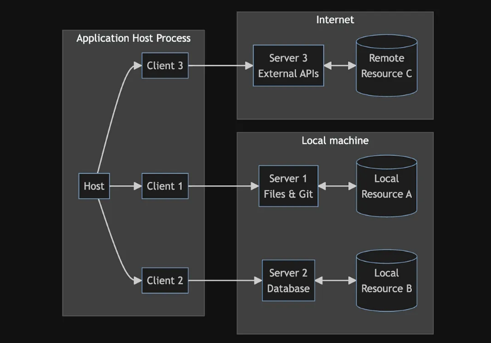

# [Model Context Protocol](https://modelcontextprotocol.io/)

E' un protocollo open source annunciato il [25 Novembre 2024 da Anthropic]((https://www.anthropic.com/news/model-context-protocol)) che permette in una modalità standardizzata di fornire contesti ai LLM, ossia tool esposti da server che possono essere consumati da client (scritti in linguaggi diversi da tali server). L'idea è quella di fornire delle connessioni bidirezionali e sicure tra le AI applications (MCP Client) e i server che espongono funzionalità (MCP Server), come un layer tra le APIs e i LLM.

LLM sono dei sistemi Text In / Text Out cioè prendono del testo in input e generano un output testuale **ma non hanno accesso a fonti di dati esterne**, la sola conoscenza che hanno è legata all' "addestramento" che hanno ricevuto fino ad una certa data (la `cutoff date`, ad esempio su ollama con `llama3.2:latest` facendo la domanda `what is your cutoff date?` si ottine `My knowledge cutoff date is currently December 2023`). Se facessimo la domanda che ore sono a Tokyo? a un LLM, esso non saprebbe rispondere perchè non ha accesso a fonti di dati esterne. 

Se chiedessimo ad un LLM di recuperare dati da un DB si dovrebbe scrivere del codice di configurazione per eseguire dei tools, e questo è il problema che MCP vuole risolvere. A cose normali l'LLM:
- non sa niente dei dati del db quindi decide, in base ad una configurazione, di usare un tool call
- il risultato della tool call è utilizzato al prompt successivo
- l'llm può usare questo contesto per dare una risposta

Per fare questo o si può programmare "from scratch" o utilizzando dei framework (langchain, langgraph, lamaindex, etc). IL MCP è una maniera di standardizzare questi collegamenti creando tramite una architettura client/server un contesto di funzionalità per le applicazioni che utilizzano gli LLM.

## Architettura

A livello di architettura `Host` è ogni applicazione, che utilizza LLM, (come claude desktop ma anche VSC che con cline utilizza dei tool per eseguire funzionalità) che dialoga con più client che hanno una relazione uno ad uno con MCP server che forniscono/espongono una lista di tools. Ogni client presenta all'Host un contesto di possibilità/funzionalità che può essere usato dall'host.

Vedere la lista delle applicazioni al momento [disponibili](https://modelcontextprotocol.io/clients) che supportano MCP ed la lista [awesome-mcp-clients](https://github.com/punkpeye/awesome-mcp-clients/). Un esempio di applicazione con electron, react e ollama è [5ire](https://github.com/nanbingxyz/5ire).

L'LLM può recuperare la lista di tool esposta dai server MCP e può utilizzarle per generare risposte + accurate.

Il protocollo supporta http quindi è possibile creare applicazioni con + client che parlano con i rispettivi server su internet (non necessariamente quindi server locali...).

## Tools
Per debuggare e testare MCP Servers utilizzare [l'inspector](https://github.com/modelcontextprotocol/inspector)

## Links
- [Official Documentation site](https://modelcontextprotocol.io/introduction)
- [Official Typescript SDK](https://github.com/modelcontextprotocol/typescript-sdk)
- [Official Typescript SDK Example](https://github.com/modelcontextprotocol/typescript-sdk?tab=readme-ov-file#sqlite-explorer)
- [Fast MCP Server Framework](https://github.com/punkpeye/fastmcp)
- [Article + Youtube video: Build Your First MCP Server with TypeScript](https://hackteam.io/blog/build-your-first-mcp-server-with-typescript-in-under-10-minutes/)
- [Article Writing an MCP Server with Typescript](https://medium.com/@dogukanakkaya/writing-an-mcp-server-with-typescript-b1caf1b2caf1)

- [Writing an MCP Server with Typescript](https://medium.com/@dogukanakkaya/writing-an-mcp-server-with-typescript-b1caf1b2caf1)

## Esempi di mCP Servers
- [Official Server](https://github.com/modelcontextprotocol/servers)
- [MCP.so](https://mcp.so/)
- [awesome mcp servers](https://github.com/punkpeye/awesome-mcp-servers)
- [Glama](https://glama.ai/mcp/servers)
- [Ollama-mcp](https://github.com/rawveg/ollama-mcp) che espone tool per fare query a ollama.
- [web-search in typescript](https://github.com/pskill9/web-search)
- [file system](https://github.com/modelcontextprotocol/servers/tree/main/src/filesystem)
- [Brave search api](https://github.com/modelcontextprotocol/servers/tree/main/src/brave-search)

## MCP with Ollama
- [Video: Anthropic MCP with ollama](https://www.youtube.com/watch?v=9mciRwpcLNY&t=13s) and [python code](https://github.com/chrishayuk/mcp-cli)
- [Article:A quick look at MCP with Large Language Models and Node.js](https://developers.redhat.com/blog/2025/01/22/quick-look-mcp-large-language-models-and-nodejs) and [code](https://github.com/mhdawson/ai-tool-experimentation/blob/main/mcp/ollama-mcp.mjs)
- [A bridge implementation between ollama and MCP in typescript](https://github.com/patruff/ollama-mcp-bridge/tree/main) and [realtive video](https://www.youtube.com/watch?v=qShnGNZRXKM)
- [Article: Using an MCP SSE Server with LangchainJS and Ollama 03/25](https://k33g.hashnode.dev/using-an-mcp-sse-server-with-langchainjs-and-ollama) with [code](https://github.com/ollama-tlms-langchainjs/04-mcp-sse-client)

## Esempi di MCP Clients
- [Playlist Video Building MCP Clients in TypeScript](https://www.youtube.com/playlist?list=PLmgCjludJpdnIFS8700wMr_gzveGH1lJG)
- [Video: Build a MCP Client in Typescript, ReactJS & Cursor](https://www.youtube.com/watch?v=jog5-UigoTg)

## Costruire un MCP Server
- [Corso Model Context Protocol Tutorial in Typescript](https://www.aihero.dev/model-context-protocol-tutorial)
- [Articolo: WASImancer, an MCP server with SSE transport, powered by WebAssembly](https://k33g.hashnode.dev/wasimancer-an-mcp-server-with-sse-transport-powered-by-webassembly)

## Python
- [mcp-cli](https://github.com/chrishayuk/mcp-cli) usato nell'[articolo](https://www.greghilston.com/post/model-context-protocol/)