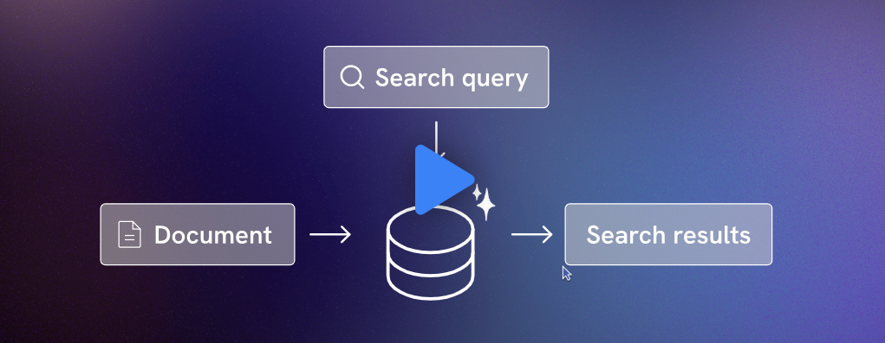
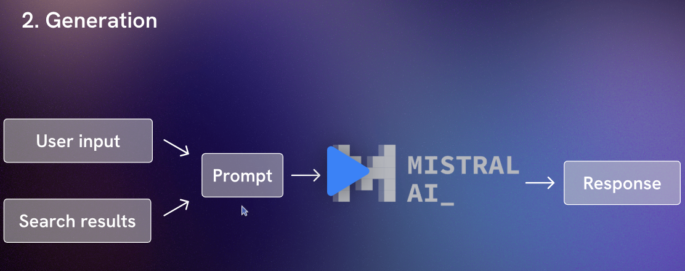

# Mistral AI
[Mistral](https://mistral.ai/en) è una società che produce "foundational models" che nel 2023 è appasa sul mercato competendo con OpenAI. Ha un [chat assistant](https://chat.mistral.ai/chat) chiamato Lucia che permette di interagire con il modello. Si può interagire con il modello anche tramite - API Endopoint (bisogna prendere una API KEY).
- Cloud services (che forniscono un'infrastruttura.scalabile e sicura per eseguire modelli di IA)
- Infrastrutture on premise

## Indice corso
- Eseguire modelli localmente
- API e JS SDK (esiste anche il python SDK)
- Modelli
- Embeddings
- Vector databases (per dare alle app il così detto DOMAIN KNOLEDGE, come dati proprietari e real time information per cui il modello non è in precedenza stato allenato o informazioni extra)
- **Retrieval augmented generation** (RAG)
- **AI Agents with function calling** che permettono alle app di prendere azioni in base all'user prompt


## Mistral Models
[I modelli di Mistral](https://mistral.ai/en/models#models) sono:
- mistral7B (open source)
- mistral8x7 (open source mix di esperti)
- small, medium, large  (enterprice grade), multi-lingual models con function calling, JSON mode 32K context window + un modello per embeddings.

E' possibile accedere ai modelli tramite API endpoints (La plateforme) o Public Cloud o On-premise. I modelli vanno in termini di percentuale MMLU (Massive multitask language understanding) dal 62,5% di Mistral7b al 81,2% di Mistra-Large.

**NB:** Hugging face è una piattaforma ricca di modelli open source e dataset è [Hugging Face](https://huggingface.co/) su cui è possibile recuperare vari modelli di [mistral](https://huggingface.co/mistralai/Mistral-7B-Instruct-v0.1)


# Utlizzo
Per poter utilizzare l'API bisogna recuperare una [API keys](https://console.mistral.ai/api-keys/)

## Chat completion API
Per utilizzare il modello di chat completion in Javascriptsi può eseguire il codice seguente:

```typescript
import MistralClient from '@mistralai/mistralai';

const apiKey = process.env.MISTRAL_API_KEY || 'your_api_key';
const client = new MistralClient(apiKey);

const chatResponse = await client.chat({
  model: 'mistral-tiny',
  messages: [{ role: 'user', content: 'What is the best French cheese?' }],
  temperature: 1 // livello di creatività del modello (0 è il più deterministico, 1 è il più creativo, 0.7 è il default)
});

console.log(chatResponse.choices[0].message.content);
```

Da notare che per guidare il comportamento del modello si possono aggiungere dei "system prompts":
```typescript

const chatResponse = await client.chat({
    model: 'mistral-tiny',
  messages: [
      { 
        role: 'system', 
        content: 'sei un appassionato di formaggio e quando ti verrà richiesto di formaggi, rispondi concisamente e con humour' 
      },
      { role: 'user', content: 'What is the best French cheese?' }
    ],
  temperature: 1,
});

```
Le opzioni prevedono di aggiungere il:
-  supporto per lo streaming. 

```typescript

const chatResponse = await client.chatStream({
    model: 'mistral-tiny',
  messages: [
      { 
        role: 'system', 
        content: 'sei un appassionato di formaggio e quando ti verrà richiesto di formaggi, rispondi concisamente e con humour' },
      { role: 'user', content: 'What is the best French cheese?' }
    ],
  temperature: 1,
});

// chatResponse è un oggetto Iterable
for await (const chunk of chatResponse) {   
    console.log(chunk.choices[0].delta.content);
} 
```
E' possibile avere la risposta in formato JSON:
```typescript
const chatResponse = await client.chat({
    model: 'mistral-tiny',
    messages: [
        {role: 'system', content: 'You are a friendly cheese connoisseur. When asked about cheese, reply concisely and humorously. Reply with JSON.'},
        {role: 'user', content: 'What is the best French cheese?'}
    ],
    temperature: 0.5,
    response_format: {
        type: "json_object"
    }
});

// '{ "answer": "Why, that's like asking which child is your favorite! But if I must pick, I'd go with Brie de Meaux. It's a classic, like a good French beret or an accent.", "cheese": { "name": "Brie de Meaux", "country": "France", "type": "Soft" } }'
console.log(chatResponse.choices[0].message.content);
```


## RAG
RAG (Retrieval-Augmented Generation) è una tecnica che combina il recupero di informazioni (retrieval) con la generazione di testo (generation) per migliorare la qualità e l'accuratezza delle risposte di un modello di linguaggio.

🔹 Come funziona RAG?
Recupero delle informazioni (Retrieval) → Il modello cerca dati aggiornati o rilevanti da fonti esterne (documenti, database, web, API).

Una volta rerecuperati i dati si conservano in un vector DB (ossia in un formato, i così detti **embeddings** che può essere facilmente utilizzato dal modello) e si possono fare delle query (anch'esse messe in un formato embedded) per avere un risultato  come prodotto di un semantic search. I risultai della ricerca e l'user prompt vengono poi passati al modello di generazione come un singolo prompt che il modello LLM utilizza come input.


Generazione della risposta (Generation) → L'LLM usa queste informazioni per formulare una risposta contestuale e accurata.

Esempi pratici:
1. Rispondere con dati aggiornati
Senza RAG → Un LLM potrebbe basarsi su dati pre-addestrati e dare informazioni obsolete.
Con RAG → Il modello cerca dati in tempo reale, ad esempio da Google o un database interno.
👉 "Chi è il presidente degli USA?"
  - Normale LLM → "Secondo i miei dati, il presidente è Joe Biden." (potenzialmente obsoleto)
  - LLM con RAG → Recupera la risposta da una fonte aggiornata: "Il presidente attuale è [Nome]."

2. Chatbot aziendali con documentazione interna
Un'azienda ha un assistente virtuale per supporto tecnico.
👉 "Come resetto la password del CRM?"
- Normale LLM → Potrebbe dare istruzioni generiche.
- LLM con RAG → Recupera la guida più recente dall'intranet aziendale e fornisce istruzioni precise.

In definitiva i vantaggi sono:
- ✅ Risposte più aggiornate e affidabili
- ✅ Meno allucinazioni (errori nei dati)
- ✅ Maggiore adattabilità per domande specifiche

RAG è particolarmente utile per chatbot, motori di ricerca intelligenti e assistenti aziendali!

Gli **embeddings** sono il modo per rappresentare testi, immagini o altri dati in una forma numerica che un computer può elaborare facilmente. In parole semplici, sono liste di numeri (vettori) che catturano il significato  di parole, frasi o documenti e loro relazioni in uno spazio matematico (che non ha 2 dimentsioni ma spesso centinaia di dimensioni...).
Perchè servono? I computer non capiscono il linguaggio naturale direttamente, quindi dobbiamo trasformare le parole in numeri in modo che:
- ✅ Parole simili abbiano rappresentazioni simili.
- ✅ Possiamo confrontare testi e trovare relazioni tra loro e categorizzare .
- ✅ Possiamo cercare documenti in base al significato e non solo alle parole esatte.


L'idea è quella di frazionare il testo in parti di testo + piccole (chunk) e di produrre gli embedding di tali parti di testo. Di solito + è corto il chunk e miglioreè il significato anche se potrebbe perdere un contesto esteso su più frasi.  Questi embedding sono poi usati per fare una query nel DB per trovare i chunk più simili al prompt dato e costruire un prompt con la query originale + i chunk e passare la query finale al modello.

```js
async function splitDocument() {
    const response = await fetch('handbook.txt');
    const text = await response.text();
    console.log(text);
}

splitDocument();
```
Si usa un framework come [Langchain](https://js.langchain.com/v0.1/docs/modules/data_connection/document_transformers/character_text_splitter/) che permette di frazionare il testo tramite il modulo CharacterTextSplitter o RecursiveCharacterTextSplitter.

```js
import { RecursiveCharacterTextSplitter } from "langchain/text_splitter";
import MistralClient from "@mistralai/mistralai";
const client = new MistralClient(process.env.MISTRAL_API_KEY);

async function splitDocument(path) {
    const response = await fetch(path);
    const text = await response.text();
    const splitter = new RecursiveCharacterTextSplitter({
        chunkSize: 250,
        chunkOverlap: 40
    });
    const output = await splitter.createDocuments([text]);
    const textArr = output.map(chunk => chunk.pageContent);
    return textArr;
}

const handbookChunks = await splitDocument('handbook.txt');

async function createEmbeddings(chunks) {
    const embeddings = await client.embeddings({
        model: 'mistral-embed',
        input: chunks
    });
    const data = chunks.map((chunk, i) => {
        return {
            content: chunk,
            embedding: embeddings.data[i].embedding
        }
    });
    return data;
}

console.log(await createEmbeddings(handbookChunks));
```
## Vector DB
I database vettoriali hanno la capacità di conservare e recuperare velocemente e con una buona scalatura, dati in formato vettoriale. Quando si fa una query si cerca il vettore più simile al vettore della query e non si cerca per uguaglianza (come per i DB tradizionali). Oggi i più comuni sono:
- Faiss
- Chroma
- Pinecone
- [Supabase](https://supabase.com/)(DB Postgres con una estensione PG vector per storage embeddings ed eseguire vector similarity search). 
Nella voce "Extensions" si deve abilitare la voce "vector".
Per collegare l'applicazione con subabase si deve cliccare su project settings e copiare il Project_URL e la chiave privata e inserirle nel file .env.

```js

// data.js
import { RecursiveCharacterTextSplitter } from "langchain/text_splitter";
import MistralClient from "@mistralai/mistralai";
import { createClient } from "@supabase/supabase-js";

const mistalClient = new MistralClient(process.env.MISTRAL_API_KEY);
const supabase = createClient(process.env.SUPABASE_URL, process.env.SUPABASE_API_KEY);

async function splitDocument(path) {
    const response = await fetch(path);
    const text = await response.text();
    const splitter = new RecursiveCharacterTextSplitter({
        chunkSize: 250,
        chunkOverlap: 40
    });
    const output = await splitter.createDocuments([text]);
    const textArr = output.map(chunk => chunk.pageContent);
    return textArr;
}

const handbookChunks = await splitDocument('handbook.txt');

async function createEmbeddings(chunks) {
    const embeddings = await mistalClient.embeddings({
        model: 'mistral-embed',
        input: chunks
    });
    const data = chunks.map((chunk, i) => {
        return {
            content: chunk,
            embedding: embeddings.data[i].embedding
        }
    });
    return data;
}

const data = await createEmbeddings(handbookChunks);
await supabase.from('handbook_docs').insert(data);  // inserisce i dati nel DB
console.log("Upload complete");
```


```js
import MistralClient from "@mistralai/mistralai";
import { createClient } from "@supabase/supabase-js";

const mistralClient = new MistralClient(process.env.MISTRAL_API_KEY);
const supabase = createClient(process.env.SUPABASE_URL, process.env.SUPABASE_API_KEY);

// 1. Getting the user input
const input = "December 25th is on a Sunday, do I get any extra time off to account for that?";

// 2. Creating an embedding of the input
const embedding = await createEmbedding(input);

// 3. Retrieving similar embeddings / text chunks (aka "context")
const context = await retrieveMatches(embedding);

// 4. Combining the input and the context in a prompt 
// and using the chat API to generate a response 
const response = await generateChatResponse(context, input);
console.log(response);

async function createEmbedding(input) {
  const embeddingResponse = await mistralClient.embeddings({
      model: 'mistral-embed',
      input: [input]
  });
  return embeddingResponse.data[0].embedding;
}

// si cerca di recuperare i match più simili al prompt dell'utente
async function retrieveMatches(embedding) {
    const { data } = await supabase.rpc('match_handbook_docs', {
        query_embedding: embedding,
        match_threshold: 0.78,
        match_count: 5
    });
    return data.map(chunk => chunk.content).join(" ");
}


async function generateChatResponse(context, query) {
    const response = await mistralClient.chat({
        model: 'mistral-large-latest',
        messages: [{
            role: 'user',
            content: `Handbook context: ${context} - Question: ${query}`
        }]
    });
    return response.choices[0].message.content;
}

```

## AI Agents with Function Calling
Il function calling in un LLM (Large Language Model) è la capacità del modello di riconoscere quando una richiesta dell'utente corrisponde a una funzione specifica e di generare automaticamente l'input corretto per chiamarla. Questo permette all'LLM di interagire con API, database o strumenti esterni in modo strutturato.

📌 Come funziona il function calling?
L'utente fa una richiesta → L'LLM riconosce che la richiesta può essere soddisfatta chiamando una funzione.
L'LLM genera l'input corretto → Costruisce un oggetto JSON o un'altra struttura compatibile con la funzione.
La funzione viene eseguita → Il sistema esegue la funzione con i parametri forniti.
L'LLM restituisce il risultato → Può spiegare il risultato all'utente o utilizzarlo per generare una risposta.

Esempi pratici
1️⃣ Ottenere il meteo
Richiesta dell'utente:
👉 "Che tempo fa oggi a Milano?"

L'LLM riconosce che deve chiamare una funzione per ottenere il meteo:

```json
{
  "function": "get_weather",
  "parameters": {
    "city": "Milano",
    "date": "2025-02-05"
  }
}
```
La funzione get_weather esegue la chiamata a un'API meteo e restituisce:

```json
{
  "temperature": "12°C",
  "condition": "Parzialmente nuvoloso"
}
```
L'LLM risponde all'utente:
"Oggi a Milano ci sono 12°C e il cielo è parzialmente nuvoloso."

2️⃣ Convertire valuta
Richiesta dell'utente:
👉 "Quanto sono 100 dollari in euro?"

L'LLM genera:

```json
{
  "function": "convert_currency",
  "parameters": {
    "amount": 100,
    "from_currency": "USD",
    "to_currency": "EUR"
  }
}
```
La funzione ottiene il tasso di cambio e restituisce:

```json
{
  "converted_amount": 92.5
}
```
L'LLM risponde:
"100 dollari sono circa 92,5 euro con il tasso di cambio attuale."

Prenotare un appuntamento
Richiesta dell'utente:
👉 "Prenotami un appuntamento dal dentista per domani alle 15:00."

L'LLM costruisce la richiesta:

```json
{
  "function": "book_appointment",
  "parameters": {
    "service": "dentista",
    "date": "2025-02-06",
    "time": "15:00"
  }
}
```
Il sistema verifica la disponibilità e conferma:

```json
{
  "status": "confermato",
  "location": "Studio Dentistico Rossi, Via Roma 10"
}
```
Risposta dell'LLM:
"Appuntamento confermato con il dentista per domani alle 15:00 presso Studio Dentistico Rossi, Via Roma 10."

Vantaggi del function calling:
- ✅ Risposte più precise → L'LLM non deve "indovinare", ma usa dati aggiornati.
- ✅ Automazione → L'utente può interagire con servizi esterni senza scrivere codice.
- ✅ Maggiore affidabilità → Riduce errori e fraintendimenti rispetto a risposte solo testuali.

Questo approccio è utile in chatbot avanzati, assistenti vocali, automazione aziendale e molto altro!

Come un LLM riconosce che una richiesta può essere soddisfatta chiamando una funzione? Un LLM che supporta il Function Calling è addestrato o configurato per riconoscere quando una richiesta dell'utente può essere gestita da una funzione invece di generare solo testo. Questo processo si basa su diversi elementi chiave:

1️⃣ Il modello è istruito a identificare pattern di richieste
Gli LLM moderni, come quelli di OpenAI e altre implementazioni (ad es. LangChain + Ollama), sono addestrati su dataset che includono esempi di chiamate a funzioni.
👉 Questo significa che il modello ha imparato a mappare richieste specifiche a funzioni predefinite.

📌 Esempio
Se il modello ha accesso alla funzione:

```json
{
  "name": "get_weather",
  "description": "Ottiene il meteo per una città",
  "parameters": {
    "city": { "type": "string", "description": "Nome della città" }
  }
}
```
Allora, se l'utente dice:
💬 "Che tempo fa a Milano?"
L'LLM riconosce che può usare get_weather invece di generare una risposta basata su testo.

2️⃣ Il modello viene istruito con un "schema" di funzioni (JSON o altro)
I framework di Function Calling (es. OpenAI, LangChain) forniscono all'LLM un elenco di funzioni disponibili, con i loro parametri e descrizioni.
Quando il modello riceve una richiesta, analizza se può essere mappata su una funzione registrata.

🔹 Esempio di schema JSON per una funzione

```json
{
  "functions": [
    {
      "name": "get_exchange_rate",
      "description": "Ottiene il tasso di cambio tra due valute",
      "parameters": {
        "from_currency": { "type": "string", "description": "Valuta di partenza" },
        "to_currency": { "type": "string", "description": "Valuta di destinazione" }
      }
    }
  ]
}
```
Se l'utente chiede:
💬 "Quanto vale 100 dollari in euro?"
Il modello capisce che può chiamare get_exchange_rate("USD", "EUR").

3️⃣ Matching semantico tra richiesta e funzioni
Il modello non cerca solo corrispondenze esatte, ma utilizza il significato della frase per capire se può invocare una funzione.

🔹 Esempio con sinonimi e parafrasi

"Qual è il meteo oggi a Roma?"
"Dimmi che tempo fa nella capitale d'Italia"
"Fa freddo a Roma oggi?"
👉 Anche se le frasi sono diverse, il modello capisce che tutte richiedono get_weather("Roma").

4️⃣ Score di confidenza e fallback
Se il modello è molto sicuro che la richiesta può essere soddisfatta con una funzione, restituirà direttamente la chiamata alla funzione.
Se è incerto, può generare una risposta testuale o chiedere conferma all'utente.

📌 Esempio
Se l'utente dice:
💬 "Vorrei sapere il meteo..."
👉 Il modello potrebbe rispondere:
"Di quale città vuoi conoscere il meteo?"
(perché non ha abbastanza informazioni per chiamare la funzione get_weather).

# Links:
- [Scrimba course](https://scrimba.com/intro-to-mistral-ai-c035)


