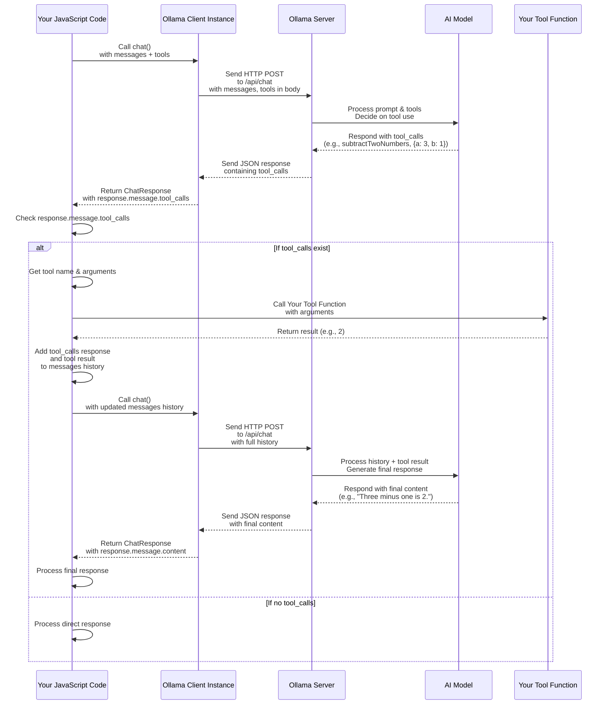

# Chapter 5: Tool Calling

Welcome back! So far, we've learned how to get our client ([Chapter 1: Ollama Client Instance](01_ollama_client_instance_.md)), perform core tasks like chatting and generating text ([Chapter 2: Core Text Generation Methods](02_core_text_generation_methods_.md)), customize those tasks with parameters ([Chapter 3: Request Parameters](03_request_parameters_.md)), and handle responses as they arrive ([Chapter 4: Streaming Responses](04_streaming_responses_.md)).

The models we've used are powerful text generators, but their knowledge is limited to the data they were trained on. They can't access the real-time internet, look up current stock prices, check the weather, perform complex calculations accurately, or interact with other systems.

This is where **Tool Calling** comes in!

## Giving the AI Superpowers: Interacting with the World

Imagine you're building an application where a user asks a question like: "What's the current price of AAPL stock?" or "What's 123 multiplied by 456?". A standard AI model, relying only on its training data, might give you a generic answer, an outdated price, or even make a multiplication error.

But what if you could give the AI the ability to *use* external tools? Like giving it access to a stock price API or a calculator function.

Tool Calling is precisely this capability. It allows the AI model, when it receives a prompt, to figure out if it needs an external "tool" (a function or service you provide) to fulfill the user's request. If it does, it will tell *your code* which tool to use and what inputs (arguments) to provide to that tool. Your code then runs the tool and sends the result back to the model, allowing the model to generate a final, accurate, and informed response based on the real-world data or action the tool provided.

Think of it like hiring a smart assistant:

1.  **You (Your Code) tell the assistant (AI Model):** "Here are some tasks you can delegate: checking stock prices (Stock Checker Tool), doing math (Calculator Tool)." You provide instructions on how to *ask* for these tasks (what info is needed).
2.  **A Customer (User) asks you:** "What's the price of Google stock?"
3.  **You ask the assistant (AI Model):** "Customer wants stock price for Google. Can you handle this with the tools I gave you?"
4.  **Assistant (AI Model) thinks:** "Hmm, 'stock price'... that sounds like the Stock Checker Tool. I should ask for 'Google' stock."
5.  **Assistant (AI Model) tells you (Your Code):** "I need to use the 'Stock Checker Tool' with the input 'Google'."
6.  **You (Your Code) receive this instruction:** You see the assistant wants the Stock Checker Tool for 'Google'.
7.  **You (Your Code) perform the task:** You *run* your actual Stock Checker function, pass 'Google' to it, and it fetches the real price (e.g., $175.50).
8.  **You (Your Code) tell the assistant (AI Model) the result:** "Okay, I used the Stock Checker Tool for 'Google', and the result was '$175.50'."
9.  **You ask the assistant (AI Model) again, with the result:** "Based on the customer's request ('Stock price for Google') and the tool result ('$175.50'), please give the final answer."
10. **Assistant (AI Model) generates final response:** "Okay, the current price for Google stock is $175.50."
11. **You (Your Code) give the final response to the customer:** "The current price for Google stock is $175.50."

This two-step interaction is the core of Tool Calling. Your code acts as the bridge between the AI model's decision to use a tool and the actual execution of that tool.

## Defining Your Tools

To enable tool calling, you need to:

1.  Have actual functions in your code that perform the desired tasks (e.g., a function that makes an API call, a function that does a calculation).
2.  Describe these functions to the AI model in a structured format. This format is often based on JSON Schema, which helps the model understand what the tool does, its name, and what arguments it needs.

In `ollama-js`, you define tools using an array of objects that follow a specific structure. This array is passed using the `tools` parameter in your `chat` or `generate` request. The most common tool type is a `function`.

Here's how you might define descriptions for simple `add` and `subtract` functions, similar to the `calculator.ts` example:

```javascript
// In your code, you'll have actual functions like these
function addTwoNumbers(args) {
    return args.a + args.b;
}

function subtractTwoNumbers(args) {
    return args.a - args.b;
}

// This is how you describe the tools to the model
const calculatorTools = [
  {
    type: 'function', // This tool is a function
    function: {
      name: 'addTwoNumbers', // The name the model will use to call it
      description: 'Add two numbers together', // What the tool does
      parameters: { // Describes the function's inputs (arguments)
        type: 'object',
        required: ['a', 'b'], // Which arguments are mandatory
        properties: { // Details about each argument
          a: { type: 'number', description: 'The first number' },
          b: { type: 'number', description: 'The second number' }
        }
      }
    }
  },
  { // Another tool definition for subtraction
    type: 'function',
    function: {
      name: 'subtractTwoNumbers',
      description: 'Subtract two numbers',
      parameters: {
        type: 'object',
        required: ['a', 'b'],
        properties: {
          a: { type: 'number', description: 'The first number' },
          b: { type: 'number', description: 'The second number' }
        }
      }
    }
  }
];
```

This `calculatorTools` array contains the structured descriptions that you'll send to the model. Each object describes one function: its `name`, a human-readable `description`, and a `parameters` object using JSON Schema to specify the expected arguments (`a` and `b`, both numbers, and both required).

## The Workflow: Two-Step Chat

Using tool calling with `ollama-js` typically involves a multi-turn conversation pattern using the `chat` method, even if the initial user query is simple.

Here's the general workflow:

1.  **Initial Request:** Send the user's message and the array of `tools` you defined to the `ollama.chat` method.
2.  **Model Response:** The model processes the message and tool descriptions.
    *   If the model *doesn't* think a tool is needed, it will return a standard message with `response.message.content`.
    *   If the model *does* think a tool is needed, it will return a response object that *includes* a `response.message.tool_calls` array. This array contains details about the tool(s) the model wants to use and the arguments it has extracted from the user's request. It typically *won't* include a final `response.message.content` in this case.
3.  **Your Code Executes Tools:** You check the response for `tool_calls`. If found, you iterate through the `tool_calls` array. For each tool call object (`tool`):
    *   Identify the tool `name` (`tool.function.name`).
    *   Extract the requested `arguments` (`tool.function.arguments`).
    *   Find the actual JavaScript function corresponding to the tool name.
    *   Call that function, passing the extracted arguments.
    *   Get the result from your function.
4.  **Send Tool Results Back:** Add two new messages to your conversation history array:
    *   The model's original response indicating the tool call (`response.message`).
    *   A new message with `role: 'tool'` and the `content` set to the result obtained from running your function.
5.  **Final Request:** Call `ollama.chat` *again* with the updated message history (original user message + model's tool call message + your tool result message).
6.  **Final Model Response:** The model receives the tool's output in the message history and now has the information it needs to formulate a final, coherent response to the user, which will be in `response.message.content`.

Let's walk through the calculator example code (`examples/tools/calculator.ts`) piece by piece.

First, the functions and tool definitions (as shown above):

```javascript
// Add two numbers function
function addTwoNumbers(args) { // args will be { a: number, b: number }
    return args.a + args.b;
}

// Subtract two numbers function
function subtractTwoNumbers(args) { // args will be { a: number, b: number }
    return args.a - args.b;
}

// Tool definitions (as shown above)
const addTwoNumbersTool = { /* ... */ };
const subtractTwoNumbersTool = { /* ... */ };
const calculatorTools = [addTwoNumbersTool, subtractTwoNumbersTool];

// A map to easily find the function by name
const availableFunctions = {
    addTwoNumbers: addTwoNumbers,
    subtractTwoNumbers: subtractTwoNumbers
};
```

We set up our actual functions and the array of tool definitions. We also create a map (`availableFunctions`) to easily look up the correct JavaScript function when the model asks for it by name.

Next, the initial chat request:

```javascript
async function run(model) {
    const messages = [{ role: 'user', content: 'What is three minus one?' }];
    console.log('Prompt:', messages[0].content);

    const response = await ollama.chat({
        model: model,
        messages: messages, // Initial user message
        tools: calculatorTools // Provide the tool definitions
    });

    // ... rest of the logic ...
}

// Call the function with a model that supports tool calling
run('llama3.1').catch(console.error);
```

We start with a single user message asking a math question. We call `ollama.chat`, specifying the model and providing the `messages` array and the `tools` array. The model (like `llama3.1` or `mistral`) will analyze the prompt and the available tools.

Now, we check the model's response for tool calls:

```javascript
    // ... inside run function after initial ollama.chat ...

    let output; // Variable to store the tool's result
    messages.push(response.message); // Add the model's response (which contains the tool call request) to history

    if (response.message.tool_calls) {
        console.log('Model wants to use a tool...');
        // Process tool calls from the response
        for (const tool of response.message.tool_calls) {
            const functionToCall = availableFunctions[tool.function.name]; // Find the actual function
            if (functionToCall) {
                console.log('Calling function:', tool.function.name);
                console.log('Arguments:', tool.function.arguments);
                output = functionToCall(tool.function.arguments); // Execute the function with args provided by model
                console.log('Function output:', output);

                // Add the function response to messages for the model to use
                messages.push({
                    role: 'tool', // Indicate this message is from a tool
                    content: output.toString(), // The output of the tool
                });
            } else {
                console.log('Function', tool.function.name, 'not found');
                // Handle case where model requested a tool we don't have
                messages.push({
                    role: 'tool',
                    content: `Error: Function ${tool.function.name} not found`,
                });
            }
        }

        // ... make the final chat call ...
    } else {
        console.log('No tool calls returned from model');
        // Handle case where model answered directly or couldn't use tools
        console.log('Model response:', response.message.content);
    }
```

After the first `ollama.chat` call, we immediately add the model's response to the `messages` history. Then we check `response.message.tool_calls`. If it exists, the model wants to use a tool.

We loop through the `tool_calls` array (there's usually only one, but it's an array). Inside the loop:
*   `tool.function.name` gives us the name the model wants to call (e.g., `'subtractTwoNumbers'`).
*   `tool.function.arguments` gives us the arguments the model extracted from the prompt (e.g., `{ a: 3, b: 1 }`).
*   We use our `availableFunctions` map to find the correct JavaScript function (`subtractTwoNumbers`).
*   We execute that function with the provided arguments (`functionToCall(tool.function.arguments)`).
*   The result (`output`) is stored.
*   Crucially, we add a new message with `role: 'tool'` and the tool's result (`output.toString()`) as `content` to the `messages` array. This tells the model, "Hey, you asked me to run a tool, and here's what it returned."

Finally, we make the second chat call:

```javascript
    // ... inside run function after processing tool calls ...

    if (response.message.tool_calls) {
        // ... (code to process tool calls and add tool message) ...

        console.log('Sending tool output back to model for final response...');
        // Get final response from model with function outputs
        const finalResponse = await ollama.chat({
            model: model,
            messages: messages // Send the updated history including the tool result
        });
        console.log('Final response:', finalResponse.message.content);
    } // ... (else block for no tool calls) ...
}
```

We call `ollama.chat` *again*, but this time the `messages` array contains the full history: the original user query, the model's request to use a tool, *and* the result from our tool. The model sees the tool output and uses it to formulate the final answer in `finalResponse.message.content`.

When you run this, the output will look something like:

```
Prompt: What is three minus one?
Model wants to use a tool...
Calling function: subtractTwoNumbers
Arguments: { a: 3, b: 1 }
Function output: 2
Sending tool output back to model for final response...
Final response: Three minus one is 2.
```

This shows the multi-step process in action!

## How Tool Calling Works (Under the Hood)

Let's trace the flow with a sequence diagram:



The diagram shows the two distinct phases: the first round trip where the model requests a tool, and the second round trip where the model uses the tool's result to give the final answer. Your code sits in the middle, orchestrating the process and running the actual tools.

This iterative nature is key to understanding tool calling. It's not a single call, but a *workflow* that can potentially involve multiple tool calls and responses before the model gives its final answer.

The `ollama-js` library handles the communication with the Ollama server. Your responsibility is to define the tools, send them with the initial request, check for `tool_calls` in the response, run your corresponding functions, and send the results back to the model as `role: 'tool'` messages.

You can find the full calculator example code in `examples/tools/calculator.ts` and another example showing a simulated flight tracker tool in `examples/tools/flight-tracker.ts`. These examples demonstrate slightly different structures for the tool definitions but follow the same core two-step chat workflow.

## Conclusion

Tool Calling is a powerful feature that extends the capabilities of AI models by allowing them to interact with the real world or specialized systems through functions you define. By providing tool descriptions to the model and handling the execution of tool calls in your code, you enable the AI to get real-time data or perform actions that are beyond its internal knowledge.

This involves a multi-step process using the `chat` method: first, the model indicates which tools it needs, and then, after your code runs the tools and sends the results back, the model generates the final response.

You now understand how to connect the AI's reasoning abilities with your application's specific functionalities, opening up possibilities for much more dynamic and capable AI-powered features.

In the next chapter, we'll look at another way to get structured information from the model: [Structured Outputs](06_structured_outputs_.md), where you tell the model to format its final response in a specific way, often JSON.

[Next Chapter: Structured Outputs](06_structured_outputs_.md)

---

<sub><sup>Generated by [AI Codebase Knowledge Builder](https://github.com/The-Pocket/Tutorial-Codebase-Knowledge).</sup></sub> <sub><sup>**References**: [[1]](https://github.com/ollama/ollama-js/blob/6a4bfe3ab033f611639dfe4249bdd6b9b19c7256/README.md), [[2]](https://github.com/ollama/ollama-js/blob/6a4bfe3ab033f611639dfe4249bdd6b9b19c7256/examples/tools/calculator.ts), [[3]](https://github.com/ollama/ollama-js/blob/6a4bfe3ab033f611639dfe4249bdd6b9b19c7256/examples/tools/flight-tracker.ts)</sup></sub>