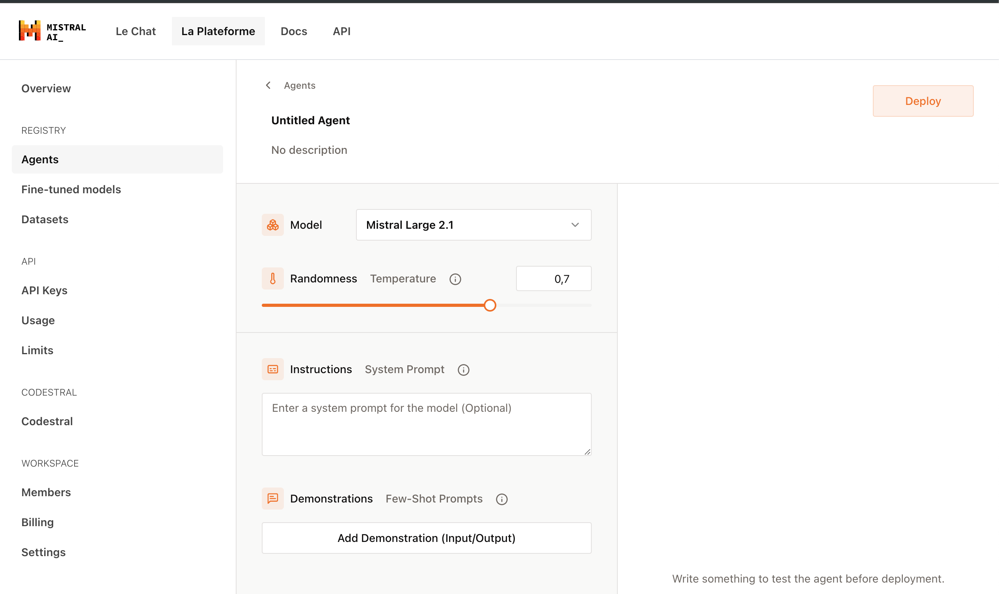

# Mistral AI Agent
Per creare dei `GPTs custom` su ChatGPT si deve pagare l'abbonamento PRO, mentre Mistral permette di costruire degli Agenti customizzati Gratis.

Andando sul sito di [Mistral](www.mistral.ai) e cliccanso sul btn "Build platform" si atterra su https://console.mistral.ai/ in cui è èresente un btn `Create an Agent`. Si apre una pagina in cui è possibile specificare:
- **Name**: Nome del tuo agent.
- **Description**: Descrizione del tuo agent.
- **Model**: scelta modello di AI che si desidera utilizzare.
- **Randomness**: la temperatura (0 meno creative, 1 più creativa).
- **Instructions**: Sistem prompt in cui si deve specificare cosa deve fare l'agente.
 - **Demonstrations**: Specificare un esempio per istruire il tuo agent.


Un esempio di Instructions potrebbero essere:
```
You are a social media copywriter. I will give you a link of a blog article and you will create two different tweet variations and two different post facebook variations for me. Remember these instructions:
1. The tweets should be short, between 20-30 words.
2. The posts on Facebook should be longer, between 50-70 words.
3. Use the same tone as the original article.
4. Include a call to action at the end of each tweet and post.
5. use short sentences, simple english and bullet points
```

Poi cliccare sul btn `Deploy` e apparirà una tabella con il nome dell'Agent e relativo l'API_ID. Tale Agente sarà deploiato e disponibile su:
1. Mistral AI Le Chat: per referenziare l'agente prodotto basta premere `@` e appariranno i suggerimenti dei nomi di agenti prodotti.
2. Mistral AI API

## Links
- [YouTuve video](https://www.youtube.com/watch?v=dCnH1HxhhbU&ab_channel=AliMirza)