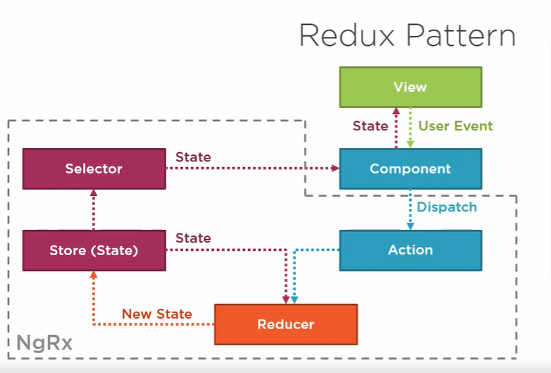

# Angular NgRx

NgRx è una libreria che implementa il pattern di Redux. Per strutturare l'interazione e la comunicazione dei componenti, gestire lo state dell'applicazione ed unificare gli eventi dell'app, è nolto utilizzato il pattern di Redux basato sul "one way data flow", "store as single source of thruth" e "immutable store"(ossia lo state è readonly ed è cambiato solo da dispatched actions tramite funzioni "pure" chiamate reducers) e nell'ecosistema Angular la libreria + usata è NgRx che obbliga ad obbedire a tale pattern "consistente" durante la crescita di un'app.

Invece di avere n service ognuno con una parte di state si usa un singolo "store" (che funge da cache client side), che può essere modificato da azioni.

> Redux is not great for making simple things quickly. It's great for making really hard things simple. Jani Evakallio



Di solito non si usa quando il team è "giovane", l'applicazione è semplice o se il team ha già un buon pattern di state management.

Nel caso si decida di utilizzarlo la cosa + importante è:

- mettere dentro lo store **_solo lo stato condiviso tra + componenti_** (mandatorio quindi non mettere lo stato dei form o lo stato di elementi non serializzabili (come il router))
- organizzare lo store come insieme di feature module (slices of state)

## Installazione

```bash
#  1. istallazione normale
npm install @ngrx/store --save

# 2. con la Cli (che mette lo store dentro il root application module)
ng add @ngrx/store
```

Si usa la così detta `Feature Module State Composition` dove si fraziona lo store in parti distinte. All'interno del modulo principale si mette uno lo store "padre"

```typescript
// app-module.ts
import { StoreModule } from '@ngrx/store';

@NgModule({
  imports: [
    BrowserModule,
    HttpClientModule,
    ...
    StoreModule.forRoot({},{ }) // reducer, config obj
  ],
  declarations: [
    ...
  ],
  bootstrap: [AppComponent]
})
export class AppModule { }

// product.module.ts
import { StoreModule } from '@ngrx/store';
import { productReducer } from './state/product.reducer';

const productRoutes: Routes = [
  { path: '', component: ProductShellComponent }
];

@NgModule({
  imports: [
    SharedModule,
    RouterModule.forChild(productRoutes),
    StoreModule.forFeature('products', productReducer) // si crea lo store by feature (in questo caso nello store si avrà la propietà "products")
  ],
  declarations: [
    ...
  ]
})
export class ProductModule { }

/*
// Oppure si possono avere "sotto moduli" con:
StoreModule.forFeature('products', {
        productList: listReducer,
        productData:dataReducer
    }
)

// Lo store sarà:
{
    products: {
        productList: {
            showProductCode:true,
            items:[...]
        },
        productData:{
            products:[...]
        }
    }
}
*/

// si creano poi i REDUCERS
// state/product.reducer.ts
import { createReducer, on, createAction } from '@ngrx/store';

export const productReducer = createReducer(
  { showProductCode: true },    // stato iniziale
  on(createAction('[Product] Toggle Product Code'), state => {
    return {
      ...state,
      showProductCode: !state.showProductCode
    };
  })
);

// COME SI UTILIZZA
// nel componente si importa lo store
import { Store } from '@ngrx/store';

// I) si dispatcha l'action con
this.store.dispatch(
    { type: '[Product] Toggle Product Code' }
);

// II) si sta in ascolto nell ngOnInit di tutto lo stato afferente a "products"
this.store.select('products').subscribe(
    products => {
        this.displayCode = products.showProductCode;
    });
}
```

**_DA RICORDARSI SEMPRE QUANDO SI COSTRUISCONO I COMPONENTI_**: CHIEDERSI QUALE STATO SI VUOLE CONSERVARE IN MEMORIA ALL'USCITA DALLA PAGINA/COMPONENTE

## Strongly Typing the state

Lo state (o slices of state) va tipizzato con delle interfacce!:

```typescript
// da evitare!!!
constructor(private store:<any>){}

export interface AppState {
  hideWelcomePage:boolean;
}
// slice dei prodotti
export interface ProductState {
  showProductCode:boolean;
  currentProduct:Product;
  products:Product[]
}
/* ----- globale ----- */
export interface State {
  app:AppState;
  products: ProductState;
}

constructor(private store:<State>){}
```

Ci stanno però dei moduli che sono caricati in lazy loading pertanto l'idea è di avere lo stato dell'app che viene esteso dallo stato dei moduli che vengono caricati in lazy loading:

```typescript
/* dentro app/state/app.state.ts */

// modulo non in lazy loading
import { UserState } from "../user/state/user.reducer";

// Representation of the entire app state
// Extended by lazy loaded modules
export interface State {
  user: UserState;
}

// products/state/product.reducer.ts
import { Product } from "../product";

/* NgRx */
import {
  createReducer,
  on,
  createFeatureSelector,
  createSelector,
} from "@ngrx/store";
import * as ProductActions from "./product.actions";
import * as AppState from "../../state/app.state";

// Extends the app state to include the product feature.
// This is required because products are lazy loaded.
// So the reference to ProductState cannot be added to app.state.ts directly.
export interface State extends AppState.State {
  products: ProductState;
}

// State for this feature (Product)
export interface ProductState {
  showProductCode: boolean;
  currentProduct: Product;
  products: Product[];
  error: string; // permette di gestire gli errori nelle chiamate async
}
```

Riassumento si deve:

- definire un interfaccia per ogni slace of state
- si deve comporre il global application state (considerando moduli in lazy loading oppure no)
- usare delle interfacce per rendere lo stato strongly typed

L'idea è quella di avere una cartella con dentro delle sottocartelle per ogni esntità del framework:


## Selectors

Invece di mettere delle stringhe come "indicatore" di porzioni di stato, ed invece di ascoltare tutte le variazioni di uno stato si usano i così detti `selector` come delle query riutilizzabili e cachate che permettono di accedere a copie di parti selezionate, strongly typed ed eventualmente anche effettuare manipolazioni dello stato.

```typescript

// 1) si usa createFeatureSelector per prendere tutto la feature slice of state
const getProductFeatureState = createFeatureSelector<ProductState>('products');

// 2) si COMPONE dei selector per elementi figli
// tramite la createSelector fn
export const getShowProductCode = createSelector(
  getProductFeatureState,
  state=> state.showProductCode // detta projector fn
)

// SENZA un selettore
this.store.select('products').subscribe(
    products => {
        this.displayCode = products.showProductCode;
    });
}

// CON il selettore
import { State, getShowProductCode} from '../state/product.reducer';

this.store.select(getShowProductCode).subscribe( showProductCode => this.displayCode=showProductCode)
```

## Actions

Tramite gli action creator è possibile creare azioni strongly typed.

L'idea è quella di avere un file con tutte le actions:

```typescript
import { Product } from "../product";

import { createAction, props } from "@ngrx/store";

export const toggleProductCode = createAction("[Product] Toggle Product Code");

// quando si vuole passare anche dei dati si usa la fn props a cui si passa il tipo dei dati generici
export const setCurrentProduct = createAction(
  "[Product] Set Current Product",
  props<{ product: Product }>()
);
```

```typescript
// 1) si definisce così l'azione in state/actions
export const setCurrentProduct = createAction('[Product] SetCurrentProduct')

// 2) all'interno del reducer si usa così
import * as ProductActions from './state/actionss'
export const productReducer = createReducer<ProductState>({
  initialState,
  on(...)
  on(ProductActions.setCurrentProduct, (state, action):ProductState => {
    return {
      ...state,
      currentProduct: action.product
    };
  })
});

// 3) per il dispatch si usa così:
import * as ProductActions from '../state/product.actions';
productSelected(product:Product):void {
  this.store.dispatch(ProductActions.setCurrentProduct({product})
}
```

Quando si hanno delle chiamate http il reducer chiama i servizi http che quando ritornano dispatchano a loro volta altre actions:


Da notare che in tale caso si ha quindi una azione per fare la chiamata `loadProduct`, una action una volta che si ha una response in SUCCESS `loadProductSuccess` ed una action quando si ha una chiamata in errore `loadProductError` .

## Effects


A volte le azioni hanno bisogno di operazioni asincrone o altre operazioni con side effect. Si usa pertanto la libreria `@ngrx/effects` che gestisce i side effects (operazione che interagiscono con sistemi esterni) mantenendo "puri" sia i componenti che i reducers, (cioè in sostanza non si vuole chiamare i metodi dei servizi http nè dentro un componente nè dentro un reducer). Gli effetti prendono una action, svolgono un lavoro e dispatchiano una nuova azione.

1. Si importa nel modulo pruncipale dell'app e si registrano gli effetti.

```typescript
import { EffectsModule } from '@ngrx/effects';

@NgModule({
  imports: [
    ...
    EffectsModule.forRoot([
      ProductEffects // si passa un [ ] di Effetti
    ])
  ],
  declarations: [...],
  bootstrap: [AppComponent]
})
export class AppModule { }
```

2. Si costruiscono gli effect per processare le azioni e dispatch di azioni di success o azioni di errore. Per definire un effetto si usa un service

```typescript
import { mergeMap, map, catchError } from "rxjs/operators";
import { of } from "rxjs";
import { ProductService } from "../product.service";

/* NgRx */
import { Actions, createEffect, ofType } from "@ngrx/effects";
import * as ProductActions from "./product.actions";

@Injectable()
export class ProductEffects {
  constructor(
    private actions$: Actions,
    private productService: ProductService
  ) {}

  loadProducts$ = createEffect(() => {
    return this.actions$.pipe(
      ofType(ProductActions.loadProducts),
      mergeMap(() =>
        this.productService.getProducts().pipe(
          map((products) => ProductActions.loadProductsSuccess({ products })),
          catchError((error) =>
            of(ProductActions.loadProductsFailure({ error }))
          ) // fail action
        )
      )
    );
  });
}
```

Per usare un effetto si usa:

```typescript

// 1) si inietta lo store nel componente
constructor(private store: Store<State>){}

// 2) Si chiama il metodo
this.store.dispatch(ProductActions.loadProducts())

// 3) Si seleziona lo stato che ritorna
this.products$ = this.store.select(getProducts)

// si usa l'async pipe nel template: *ngIf=products$ | async as products
```

Ad esempio nel componente si avrà:

```typescript
import { Store } from "@ngrx/store";
import {
  State,
  getShowProductCode,
  getCurrentProduct,
  getProducts,
  getError,
} from "../state/product.reducer";
import * as ProductActions from "../state/product.actions";

@Component({
  selector: "pm-product-list",
  templateUrl: "./product-list.component.html",
  styleUrls: ["./product-list.component.css"],
})
export class ProductListComponent implements OnInit {
  pageTitle = "Products";
  displayCode$: Observable<boolean>;
  errorMessage$: Observable<string>;
  products$: Observable<Product[]>;

  selectedProduct$: Observable<Product>;

  constructor(private store: Store<State>) {}

  ngOnInit(): void {
    /* ricezione dati */
    //  async pipe
    this.products$ = this.store.select(getProducts);
    //  async pipe
    this.errorMessage$ = this.store.select(getError);
    //  async pipe
    this.selectedProduct$ = this.store.select(getCurrentProduct);
    //  async pipe
    this.displayCode$ = this.store.select(getShowProductCode);

    /* caricamento dadti !! */
    this.store.dispatch(ProductActions.loadProducts());
  }

  checkChanged(): void {
    this.store.dispatch(ProductActions.toggleProductCode());
  }

  newProduct(): void {
    this.store.dispatch(ProductActions.initializeCurrentProduct());
  }

  productSelected(product: Product): void {
    this.store.dispatch(ProductActions.setCurrentProduct({ product }));
  }
}
```

Da notare che NgRx non permette di gestire automaticamente gli errori che devono essere tracciati nello stato e nelle action. Si deve pertanto avere azioni di success e azioni di errore nel reducer

## Note

Ricordarsi che nel template si può mettere l'operatore `?` per prevenire errori di rendering

```html
<button
  [ngClass]="{'active': product?.id=== (selectedProduct$ | async)?.id}"
></button>
```

Ricordarsi che `.subscribe` è considerato ora un antipattern e si dovrebbe sempre sfruttare l'async pipe per sfruttare la gestione automatica di angular nel subscribe/unsubscribe:

```typescript
// al posto di
this.store
  .select(getCurrentProduct)
  .subscribe((currentProduct) => this.displayProduct(currentProduct));

// si sostituisce con un observable ed usare nel template
//  *ngIf="product$ | async as product"
this.product$ = this.store
  .select(getCurrentProduct)
  .pipe(tap((currentProduct) => this.displayProduct(currentProduct)));
```

Ricordarsi sempre che in fase di dichiarazione può essere utile mettere un Observable che contiene "qualcosa" o null!.

```typescript
product$: Observable<Product | null>
```

### Barrel file

Può essere utile creare un barrel file, che esporta soltanto risorse "selezionate" da molti moduli in un singolo modulo ;

```typescript
// app/index.ts
export {Foo} from './app/foo';
export {Bar} from './app/bar';
export * as Baz* from './app/baz';

// il modulo utilizzatore può prendere tutto con
import {Foo, Bar, Baz} from './app'
```

E' comune in NgRx avere un file index.ts in ogni cartella di stato che reesporta tutte le interfacce, selectors da un file unico (diventa come una API pubblica per ogni feature state).

### Unsubscribe strategies

Relativamente alle strategie di unsubscribe, oltre a usare l'async pipe e il metodo manuale con il metodo `.unsubscribe()` è utile usare l'operatore `takeUntil` o `take`:

```typescript
// metodo manuale
@Component({...})
export class AppComponent implements OnInit, OnDestroy {
    subscription1$: Subscription
    subscription2$: Subscription
    ngOnInit () {
        var observable1$ = Rx.Observable.interval(1000);
        var observable2$ = Rx.Observable.interval(400);
        this.subscription1$ = observable.subscribe(x => console.log("From interval 1000" x));
        this.subscription2$ = observable.subscribe(x => console.log("From interval 400" x));
    }
    ngOnDestroy() {
        this.subscription1$.unsubscribe()
        this.subscription2$.unsubscribe()
    }
}
```

```typescript
// take(1)
ngOnInit(){
      this.http.get(this.API).pipe(take(1)).subscribe(
        res => {
          this.data = res;
        }, err =>{
          alert(err);
        }
      );
```

```typescript
// takeUntil
stop$ = new Subject<void>()

// all'interno di ogni sottoscrizione si usa:
ngOnInit(){
  this.src.pipe(
    takeUntil(this.stop$))
    .subscribe(value => {
      console.log("Obs1 " + this.id);
    });
}

ngOnDestroy() {
  this.stop$.next();
  this.stop$.complete();
  console.log("Component Destroyed");
}
```

[source](https://www.tektutorialshub.com/angular/unsubscribing-from-an-observable-in-angular/)
[6 metodi per fare l'unsubscribe](https://blog.bitsrc.io/6-ways-to-unsubscribe-from-observables-in-angular-ab912819a78f)

## Angular architecture

L'idea è quella di togliere la logica dai componenti e spostarla in services, reducers e effect.

- presentation and container component pattern
- change detection stategy `OnPush`: l'idea è quella di skippare la change detection in presentational component i cui @Input non sono cambiati (cioè dipende solo se cambiano input, eventi lanciati dal DOM, async pipe nel template o componenti figli mentre di default è "sempre" con `ChangeDetectionStrategy.Default`), non hanno generalmente services iniettati e comunicano con l'esterno con @output.

Inoltre può essere opportuno raggruppare azioni tra loro relazionate all'interno di file distinti. Il consiglio è quello di avere un file per gli eventi UI `product-page.actions.ts` ed un file per tutte le azioni relative a chiamate ad API `product-api.actions.ts`.

```typescript
// actions/index.ts
import * as ProductApiActions from "./product-api.actions.ts";
import * as ProductPageActions from "./product-page.actions.ts";

export { ProductApiActions, ProductPageActions };

// all'interno del file utilizzatore si avrà
import { ProductApiActions, ProductPageActions } from "./actions";
```

### State module

Da notare che si può creare uno State Module, cioè un Angular Module che gestisce logica ma non ha componenti. Si potrebbe usare per condividere stato tra moduli caricati in lazy loading. Un modulo "ordini" potrebbe avere bisogno del modulo "ordini" pertanto dovrebbero essere caricati tutti e due allo stesso momento. Si potrebbe per esempio usare uno "product state module che condivide con l'ordini module le informazioni richieste.

## Further Libraries

- `@ngrx/entities` fornisce delle helpers fn per gestire delle collezioni di entities e relative operazioni CRUD su tali entità, riducendo quindi il codice da produrre.
- `@ngrx/schematics` permette di generare codice dalla cli:
  - ng generate store
  - ng generate action
  - ng generate reducer
  - ng generate effect
  - ng generate feature
  - ng generate container
  - ng generate entity
- `@ngrx/router-store` permette di collegare il router allo store che invia delle router navigation action che possono essere processate come ogni altra azione
- `@ngrx/data` permette di astrarre tutto il codicee eliminando actions, action creators, no reduers, no selectors, no effect, no code generation.
- `@ngrx/component` insieme di helper "sperimentali".

## Tools

Con NgRx sono disponibili dei developer tools che permettono di seguire:

- le modifiche dello stato e controllare tutte le parti in gioco
- fare il time travel dello stato

Prima si deve installare l'estensione del browser (Chrome e Firefox) `Redux DevTools` poi `npm install @ngrx/store-devtools` e poi inizializzare il modulo @ngrx/store-devtools con:

```typescript
import {StoreDevtoolsModule} from '@ngrx/store-devtools';

@NgModule({
  imports: [
    ...
    StoreModule.forRoot({},{ })
    StoreDevtoolsModule.instrument({
        name:'Demo App Devtools',   // app name
        maxAge:25,  // action history length
        logOnly: environment.production
    })
  ],
  declarations: [
    ...
  ],
  bootstrap: [AppComponent]
})
export class AppModule { }
```

Tale strumento permette di vedere la storia di tutte le azioni che sono state sparate, e lo stato dell'app (ed eventualmente fare il time travel debugging).

## Links

- [NgRx](https://ngrx.io/)
- [Pluralsight course](https://app.pluralsight.com/library/courses/angular-ngrx-getting-started/)
- [Codice corso](https://github.com/DeborahK/Angular-NgRx-GettingStarted)

# Problema

Il problema è che ogni feature module ha il suo store, il suo servicehttp, componenti e tipi. Nel caso in cui un modulo condivida lo store con altri moduli caricati in lazy loading la cosa si complica. Il modulo utente non è caricato in lazy loading, ma gli altri?
