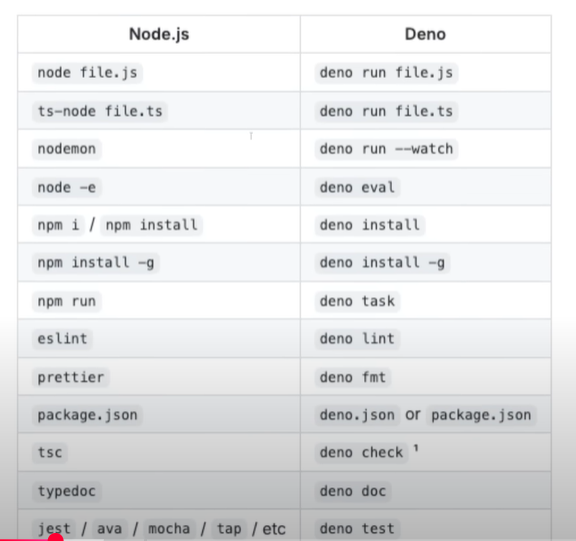

# [Deno 2](https://deno.com/)


E' un runtime JavaScript open-source moderno, rilasciato nella sua 1° versione del 2020 e nella sua 2° versione nel 2024. Anch'esso basato sul Google V8 Javascript Engine (lo stesso di Node.js e Chrome). A differenza di Node, scitto in c++ , Deno è scritto in Rust. 

Le sue carateristiche principali sono:

- Deno è sicuro by default. Non ha accesso al file system, alla rete o all'ambiente di esecuzione a meno che non sia esplicitamente concesso. 
- [TypeScript nativo](https://docs.deno.com/runtime/fundamentals/typescript/) Esegue codice typescript nativamente **senza bisogno di compilazione o dipendenze esterne** (e supporta nativamente JSX e TSX ed ultime versioni di ECMAScript) in modalità "STRICT MODE".
- Browsers Api: si possono usare le API dei browser come `fetch`, `prompt`, `Request`, `Response`, `URL`, `ReadableStream`, `WritableStream`.
- Fornisce degli strumenti di sviluppo come un [linter e formatter](https://deno.com/blog/deno-2-linting-and-formatting) e un [test runner](https://docs.deno.com/runtime/fundamentals/testing/).
- [Node e NPM compatibili](https://docs.deno.com/runtime/fundamentals/node/#using-npm-packages): è possibile usare i moduli Node e NPM.
- [Standard library](https://docs.deno.com/runtime/fundamentals/standard_library/): una libreria standard che contiene moduli di utilità per tutto, dalla manipolazione dei dati alla logica correlata al web e alle funzionalità specifiche di JavaScript. Il prefisso è `@std`.
- [JSR](https://jsr.io/): un nuovo registry per i moduli Deno, che supporta TypeScript nativamente.

Per vedere come è stato pensato vedere il libro [The internals of Deno](https://choubey.gitbook.io/internals-of-deno)

## Indice
- [VSC & DEBUG](#vsc_debug)
- [Comandi](#comandi)
- [Task](#task)
- [Linter, Formatter, bench](#linter-formatter-bench)
- [Args](#args)
- [Moduli Node e NPM](#2-uso-di-moduli-node-e-npm)
- [New JavaScript Registry (JSR)](#3-new-javascript-registry-jsr)
- [Deno Standard Library](#4-deno-standard-library)
- [Browser Wep APIS compatibile](#browser-wep-apis-compatibile)
- [Permessi](#permessi)
- [Built-in compiler](#built-in-compiler)
- [Instant Docs](#instant-docs)
- [Progetto di esempio](#progetto-di-esempio)
- [Links](#links)

## VSC DEBUG

Per debaggare il codice Deno in VSC si deve installare l'[estensione Deno](https://marketplace.visualstudio.com/items?itemName=denoland.vscode-deno) che fornisce il suo Language Server e poi settare nella cartella `.vscode` il file `settings.json` e `launch.json`:
Il 1° abilita  in VSC l'oggetto Deno dentro i file typescript, il 2° permette di fare il debug del codice typescript.
```json
// settings.json
{
  "deno.enable": true
}
```
```json
// launch.json
{
  "version": "0.2.0",
  "configurations": [
    {
      "request": "launch",
      "name": "Deno_debug",
      "type": "node",
      "program": "${workspaceFolder}/main.ts",
      "cwd": "${workspaceFolder}",
      "env": {},
      "runtimeExecutable": "C:\\Users\\lorenzo.corbella\\.deno\\bin\\deno.EXE",
      "runtimeArgs": [
        "run",
        "--unstable",
        "--inspect-wait",
        "--allow-all"
      ],
      "attachSimplePort": 9229,
      "console": "integratedTerminal"
    }
  ]
}
```
Con tale action è possibile fare il debug del codice Deno sia da un terminale interno a VSC che su Chrome collegandosi a `chrome://inspect`.

Una volta intallato si ha un unico binary che gestisce tutto.

A volte può rimanere appesa una sessione di debug su una specifica porta per killarla si usa:
```bash
lsof -i :9229 # per ricavare il PID della porta su istanza Deno
kill -9 <PID> # per killarla
```


## Comandi
Abbiamo i seguenti comandi:

```bash
## per vedere i principali comandi
deno --help
#esegue la REPL (si chiude con CTRL/CMD + D)
deno repl

## deno upgrade per aggiornare Deno o per mettere 
## una versione specifica come Node version manager
deno upgrade --version1.0.1
deno upgrade rc # per l'ultima release candidate

## per vedere le dipendenze non aggiornate
deno outdated
```

per fare il type check **senza** eseguire il codice:

```bash
deno check module.ts
# or also type check remote modules and npm packages
deno check --all module.ts
# code snippets written in JSDoc can also be type checked
deno check --doc module.ts
# or type check code snippets in markdown files
deno check --doc-only markdown.md
```

Per creare un nuovo progetto si usa:

```bash
## per creare un progetto
deno init my-demo
```
Questo crea un file deno.json contenenete i comandi e le dipendenze del progetto. Cliccando su CTRL + SPACE si hanno i suggerimenti di tutte le possibili opzioni:

```json
{
  "tasks": {
    "dev": "deno run --watch main.ts"
  },
  "imports": {
    "@std/assert": "jsr:@std/assert@1" // `alias` che puntano a specifici moduli.
  },
  "compilerOptions": {
    "noImplicitAny": false  // "strict": false per togliere lo strict mode presente di default
  }
}
```
Viene creato un file `main.ts` con il seguente codice (dove `import.meta` è un oggetto che contiene informazioni sul modulo corrente come dirname, filename, url, e appunto `main`, un booleano che indica se il file corrente è il prncipale in deno ):

```typescript
export function Helloworld():string {
  return "Hello World";
}

if (import.meta.main) {
  console.log(Helloworld());
}
```
Da notare che import.meta sostituisce i globali `__dirname` e `__filename` di Node.js.

Per eseguire il codice si usa:
```bash
# esegue il codice SENZA TYPE CHECKING
deno run hello.ts

# senza type checking e con watch mode
deno run --watch hello.ts

## CON type checking
deno run --check hello.ts
# or also type check remote modules and npm packages
deno run --check=all hello.ts
```
 Da notare che in Javascript abbiamo i moduli CommonJs (con require()) e i ES Modules (con import/export). Deno supporta solo gli ES Modules che rendono facile le esportazioni e le importazioni di funzioni, oggetti e variabili tra i file. 
 
 **NB:** Se scrivo in un file il nome di cosa voglio importare (senza import) il language server di Deno mi dovrebbe suggerire tutto ciò che è esportato dagli altri file...

 Per importare i moduli si hanno varie possibilità:
 ```typescript
// scrivendo "npm:" Deno usa poi l'autocomplete per suggerire i moduli
import {} from 'npm:...'
// oppure
import {} from 'https://deno.land/...'
// oppure senza intellicense
import {} from 'https://unpkg.com/:package@:version/:file'
```
## Task
I task sono dei comandi definiti nel deno.json che possono essere eseguiti con il comando `deno task <nome_task>`. Se è presente un package.json nel progetto è possibile anche specificare nei task di eseguire dei npm script.

```bash
# lista di tutti i comandi
deno task

# Run a task defined in the configuration file deno.json
deno task dev

# per eseguire i test (di solito i file terminano con _test.ts)
deno test main_test.ts
```

Relativamente ai task, è possibile definirli nel `deno.json`:

```json
{
  "tasks": {
    "prova": "deno run --allow-net main.ts > log.txt",
    "dev": "deno task dev:api & deno task dev:vite",
    "dev:api": "deno run --allow-env --allow-net --allow-read api/main.ts",
    "dev:vite": "deno run -A npm:vite",
    "build": "deno run -A npm:vite build", // script in package.json
    "serve": {
      "command": "deno task dev:api",
      "description": "Run the build, and then start the API server",
      "dependencies": ["deno task build"]
    }
  },
  "imports": {
    "@hono/hono": "jsr:@hono/hono@^4.6.12",
    "@solidjs/router": "npm:@solidjs/router@^0.14.10"
  },
  "compilerOptions": {
    "strict": true,
    "jsx": "react-jsx",
    "jsxImportSource": "solid-js",
    "lib": ["DOM", "DOM.Iterable", "ESNext"] // indica di mettere i tipi in tutti i file
  }
}
```
E' possibile eseguire più comandi:
- in parallelo asincronously con `&` (come una API ed un Front end) come si può fare in node con librerie quali concurrently. 
- in sequenza con `;` (anche se qualcuno fallisce il successivo girerà lo stesso...).
- in sequenza con && (il successivo si esegue se il precedente ha finito con successo).
- in sequenza con || (il successivo si avvia se il precedente fallisce).

**NB:** Notare che è possibile anche usare dei pipe `>` per passare l'output di un comando all'altro. Inoltre ci sono dei [comandi built-in](https://docs.deno.com/runtime/reference/cli/task/#built-in-commands) (che funzionano sia in MAC che WINDOWS) come `rm` e `mkdir` che possono essere usati nei task.



## Linter, Formatter, bench
Per formattare il codice, Prettier e ESLint sono integrati in Deno 2, quindi è possibile usare `deno lint --fix` per eseguire il linting e `deno fmt` per formattare il codice. Le regole possono essere riportate nel deno.json:

```json
{
  "lint": {
    "ignore": ["**/node_modules/**"],
    "rules": {
      "ban-types": "off",
      "no-namespace": "off",
      "no-explicit-any": "off"
    }
  },
  "fmt":{
    "include": ["src/**/*.ts"],
    "exclude": ["**/node_modules/**"],
  }
}
``` 
E' possibile vedere quanto bene il codice performa con il tool deno bench.

## Args
Per recuperare gli input si usa `Deno.args` che è un array di stringhe che rappresentano gli argomenti passati al programma. Oppure si può usare le funzioni formite dalla standard library:

```typescript
import {parseArgs} from "jsr:@std/cli/parse-args";
import {red, bgGreen} from "jsr:@std/fmt/colors";

const flags = parseArgs(Deno.args, {
  alias: {
    h: "help",
    v: "version",
  },
  boolean: ["help", "version"],
  string: ["name"],
  default: {
    name: "world",
  },
});

const age = prompt("How old are you?");
if(parseInt(age) < 18) {
  console.log(red("You are not old enough to use this program."));
  Deno.exit();
}

const shouldProceed = confirm("Are you sure you want to proceed?");
if(!shouldProceed) {
  console.log(bgGreen("Goodbye!"));
  Deno.exit();
}
```

## Moduli Node e NPM

Con la versione 2 è possibile usare sia i moduli node che quelli di NPM con gli
opportuni specifiers `node:` e `npm:` oppure direttamente dall'URL (come fa GO)
o tramite JSR.

```typescript
import * as os from "node:os";
console.log(os.cpus());

import * as emoji from "npm:node-emoji";
console.log(emoji.emojify(`:sauropod: :heart:  npm`));

import { sqlite3 } from "npm:sqlite3";
// oppure
import { sqlite3 } from "https://deno.land/x/sqlite3/mod.ts";
// oppure tramite JSR
import { Database } from "@db/sqlite3@0.12.0";
```


Inserire un specifier npm: in un file `deno.json` per importare facilmente il pacchetto:

```json
// deno.json
{
  "imports": {
    "chalk": "npm:chalk@5.3.0"
  }
}
```

In deno 2 sono stati introdotti diversi subcommands to simplify dependency management: `deno add`, `deno remove`, and `deno install`. Usare deno add per aggiungere dipendenze direttamente ai file `deno.json` o `package.json`:

```bash
deno add jsr:@std/path npm:chalk
```

If no config files exist, Deno will create a deno.json with an import map:

```json
{
  "imports": {
    "@std/path": "jsr:@std/path@^1.0.8",
    "chalk": "npm:chalk@^5.3.0"
  }
}
```

Per rimuovere una dipendenza:

```bash
deno remove jsr:@std/path
```

E' possibile clonare un progetto Node, ed usare `deno install` per importare tutte le dipendenze. Come npm install, deno install installs all dependencies listed in `deno.json` or `package.json`. Se il `package.json` è presente, le dependencies npm saranno installate nella cartella `node_modules`. Altrimenti, Deno installa i pacchetti nella global cache.

```bash
deno install
```

## New JavaScript Registry (JSR)

Ha un suo repository e package manager [JSR](https://jsr.io/), che supporta TypeScript nativamente (è possibile pubblicare codice TypeScript senza doverlo compilare). I moduli possono essere usati oltre che con Deno anche Bum, NPM,PNPM. Si veda il modulo di esempio
[cheer-reader](https://jsr.io/@paoramen/cheer-reader).

**NB:** Ogni modulo ha un numero sulla dx (il jsr score) che indica quanto il modulo è tipizzato. Quando si vuole importare un modulo da JSR si usa il prefisso `jsr:@` e poi compare l'intellisense. Una volta scelto il modulo si può andare dentro l'import e scrivere cosa si vuole importare (stessa cosa anche con `node:`).
```typescript
import {  } from "jsr:@...";
```


## Deno Standard Library

La deno standard library, [presente in JSR](https://jsr.io/@std), è stabile e contiene moduli di utilità per tutto, dalla manipolazione dei dati alla logica correlata al web e alle funzionalità specifiche di JavaScript.

```typescript
import { copy } from "@std/fs";
import { join } from "@std/path";

import { parse } from "https://deno.land/std@1.2.1/flags/mod.ts"; // per importare un modulo da un URL

await copy("foo.txt", join("dist", "foo.txt"));
```

## Browser Wep APIS compatibile

Deno utilizza le wep api come:

- `fetch` per fare richieste HTTP
- Prompt per interagire con l'utente
- Request e Response Object
- Url
- ReadableStream e WritableStream

```typescript
const response = await fetch("https://api.github.com/users/denoland");
const json = await response.json();
console.log(json);
```

## Permessi
Per rendere possibile i comandi di lettura e scrittura dei file, l'accesso alla rete, l'accesso all'ambiente di esecuzione e l'esecuzione di comandi esterni, l'utente deve concedere esplicitamente il permesso al runtime Deno. Questo viene fatto passando i flag `--allow-read`, `--allow-write`, `--allow-net`,
  `--allow-env` e `--allow-run` al comando deno.

```bash
deno run -A script.ts # equivalente a --allow-all
deno run -RWNE script.ts  # equivalente a --allow-read --allow-write --allow-net --allow-env
deno run -R script.ts  # equivalente a --allow-read 


deno run --allow-all script.ts
```

## Built-in compiler

E' possibile utilizzando il comando `deno compile` creare un eseguibile standalone del proprio codice Deno. Il flag `-o` permette di specificare il nome dell'eseguibile. Per rendere l'eseguibile eseguibile dovunque si deve aggiungere al $PATH.

```typescript
// main.ts
import open from "jsr:@rdsq/open";
await open("https://www.youtube.com/watch?v=dQw4w9WgXcQ");
```

```bash
deno compile -A -o runme main.ts
```

Per le varie opzioni e l'utlizzo con diversi OS vedere la pagina in
[documentazione](https://deno.com/blog/deno-compile-executable-programs) o l'[esempio di CLI](https://docs.deno.com/examples/command_line_utility/).

## Instant Docs
Una volta che abbiamo il codice con dei commenti in formato TSDoc si può generare automaticamente della documentazione per il proprio codice con il comando `deno doc --html --name="My project" <file.ts>`. Questo comando genera una cartella con un sito HTML all'interno con la documentazione del codice.

## Environment Variables
Le variabili di ambiente sono usate per passare informazioni sensibili al processo in esecuzione. E' possibile settare una o due varaibili in bash (ma anche nei deno task) tramite e poi leggerle in Deno con `Deno.env.get("HELLO")`. Oppure se le variabili sono molte si possono usare i file `.env` (spcificando nel comando --env `deno run --env app.ts`) e metterli in .gitignore.

```bash
& export HELLO=hey!
```
```typescript
// Deno.env è un oggetto con i metodi .get(), .has() .set() .delete(), .toObject().
const env = Deno.env.get("VARIABLE_NAME");
```


## Links

- [VSC Deno extension](https://marketplace.visualstudio.com/items?itemName=denoland.vscode-deno)
- [Esempi ufficiali](https://docs.deno.com/examples/)
- [Official Deno Docs](https://docs.deno.com)
- [debug deno](https://docs.deno.com/runtime/fundamentals/debugging/)
- [Standard Library](https://jsr.io/@std)
- [Fresh: official deno FE framework](https://github.com/denoland/fresh)
- [Official deno 2 tutorials](https://www.youtube.com/playlist?list=PLvvLnBDNuTEov9EBIp3MMfHlBxaKGRWTe)
  Learn Deno

## Progetto di esempio

- l'[articolo](https://deno.com/blog/build-solidjs-with-deno) ed il
  [codice](https://github.com/denoland/examples/tree/main/with-solidjs) per app SolidJS with Vite e Back end con Kono
- [websearch with ollama](https://github.com/technovangelist/videoprojects/blob/main/2024-10-01-websearch/main.ts)
- [Corso Fireship.io](https://fireship.io/courses/deno/)

## Deno.serve

E' un server HTTP integrato in Deno. E' possibile usare il comando `Deno.serve`
per avviare un server HTTP.

```ts
// server.ts

const s = Deno.serve((req) => {
  return new Response("Hello World", {
    headers: { "content-type": "text/plain" },
  });
});
```

```bash
# si esegue con 
deno run --allow-net --watch server.ts
```

## FFI (Foreign Function Interface)
La foreign function interface è un meccanismo che permette di chiamare funzioni scritte in altri linguaggi di programmazione. Deno supporta la FFI tramite il modulo `Deno.dlopen` che permette di caricare una libreria dinamica e ottenere un riferimento a una funzione in essa definita. Per farla girare è necessario usare il flag `--allow-ffi`.

```ts
// lib.rs
#[no_mangle]
pub extern "C" fn add(a: i32, b: i32) -> i32 {
    a + b
}
```

```ts   
// main.ts
const lib = Deno.dlopen("./lib.so", {
  add: {
    parameters: ["i32", "i32"],
    result: "i32",
  },
});
