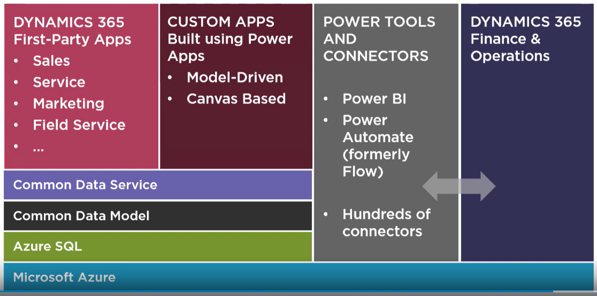

# Microsoft Dynamics 365

E' una **piattaforma o suite di applicazioni** che permette di gestire:

- Sales
- Customer service (Call Scenter)
- Field service (Servizi al cliente on site)
- Project service automation (Gestione progetti, collaborazione con teams, gestione tempo, spese e fatturazione)
- Marketing
- Finance (product orders, track inventory, and invoice customers)
- Supply chain
- Commerce: marchandising
- Human Resources: benefits, training, performance review, etc

Abbiamo la possibilità di accedere alla piattaforma tramite web client, app for phone or tablet, outlook client(che permette di fare il sync con il CRM per contatti, emails e appointments). Le app con "Hub" nel nome hanno la unified interface (ultima UI disponibile, mentre Legacy UI è meno recente).

Microsoft Dynamics 365 provvede a due macro funzionalità:

- **CRM = Customer Relationship Management** (gestione del customer lifecycle, sales customer service field service project service automation marketing)
- **ERP = Enterprise Resource Planning**, insieme dei processi relativi alle risorse di ogni azienda (finance, procurement, manifacturing, supply chain, hr,etc)

C'è inoltre una sezione di Artificial Intelligence e Mixed Reality.

La piattaforma D365 siede sopra una Application Platform basata su:

- **PowerApps**
- **Common Data Service** (servizio che permette di conservare e gestire i dati usati dalle apps)
- \_**\_[Common Data Model](https://github.com/Microsoft/CDM/blob/master/docs/CDMPoster_a3.pdf)\_\_** ed entrambi siedono sul servizio cloud Microsoft Azure.

Per estendere e customizzare la piattaforma si usano **Common Data service** (tutte le app utilizzano gli stessi dati e data schema) e **[PowerApps](https://make.powerapps.com)** che sono "no code application" di due tipi:

- Model driven app (tipo quelle del CRM che possono essere customizzate)
- Canvas app: customizzabili al pixel che possono essere connesse a multiple data sources
  e sviluppate per phone/tablet

Per le opzioni di deployment si può avere sia

- online (Dynamics 365 Apps running on Common Data Service)
- on premises (Dynamics 365 for customer Engagement)

All'interno della piattaforma si usano:

- entità che modellano e gestiscono i dati (Es: contact(individual), Account(company/organisation), Lead, Case(create e resolve case and provide customer service))
- Records (una istance di entità), Views (lista di records) e Forms (per inserire/modificare records)
- funzionalità di search (quick find, global/categorized search, advanced find)

Generalmente lo scenario + comune è:

- D365 Sales:

  - generazione di un lead
  - tramite un processo di vendita il lead diventa un customer

- D365 Supply chain management & Finance:
  - il cliente ordina prodotti o servizi che devono essere eseguiti
  - e alla fine tali prodotti devono essere fatturati

## Architettura

## Competitors

- Salesforce
- Pegasystems
- Zendesk
- Oracle
- SAP

## Terminologia

> Lead: potenziale acquirente di un dato prodotto o servizio. Si genera un lead quando, attraverso un'iniziativa di marketing, un'impresa ottiene dall'utente informazioni utili a stabilire un contatto commerciale, da utilizzare in un secondo momento per generare un'opportunità di vendità

## Links

- [Dynamics 365 home page](https://dynamics.microsoft.com/en-us)
- [Documentation Dynamics 365](https://docs.microsoft.com/en-us/dynamics365)
- [corso pluralsight](https://app.pluralsight.com/library/courses/microsoft-dynamics-365-getting-started)
