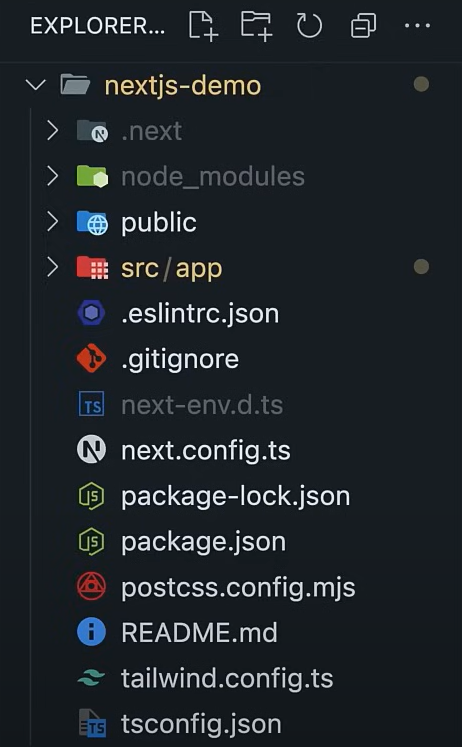

# [Next.js](https://nextjs.org/)

E' un framework di React che permette di creare applicazioni full stack. Se
React è in grado di gestire l'UI di una applicazione, Next.js si occupa di tutto
il resto (routing, optimized rendering, data fetching, bundling, compiling, etc)
senza installare ulteriori dipendenze. **Per poter utilizzare queste
caratteristiche si devono seguire delle convenzioni specifiche di Next.js**.

## Indice

- [Project setup](#project-setup)
- [React Serve Component](#react-server-component)
- [Routing in Next.js 15](#routing-in-next.js-15)
  - [Route groups](#route-groups)
  - [Link Component](#link-component)
- [Data fetching](#data-fetching)
- [Mutate data (Server Actions)](#mutate-data-(server-actions))
- [Authentication](#authentication)
- [Links](#links)

## Project setup

Si deve avere Node.js. La Cli di Next.js chiederà se si vuole typescript,
Eslint, Tailwindcss, src directory, app router e se si vuole customizzare gli
import alias:

```bash
npx create-next-app@latest nome-progetto
cd nome-progetto        
npm run dev  # start the development server on http://localhost:3000
```

La struttura del progetto prevede: 

Le configurazioni di next si trovano in `next.config.js` e `tsconfig.json` per
typescript e `.eslintrc.json` per eslint. Per Tailwind abbiamo un file
`tailwind.config.js` e `postcss.config.js` per postcss. La cartella `.next`
contiene i file generati da next.js in fase di build, `./public` per i file
statici. La cartella `./src/app` contiene i file:

- `layout.tsx` (il root layout dell'applicazione, che contiene gli elementi
  condivisi dell'applicazione)
- page.tsx` che contiene il componente root dell'applicazione
- global.css che contiene gli stili globali

## React Server Component

E' una nuova architettura introdotta dal React Team che è stata implementata da
Next.js. I componenti possono essere di due tipi:

- **Server components**: sono componenti renderizzati sul server (ed in Next.js
  15 sono il default) che permettendo di avere tempi di caricamento più veloci
  (e di non esporre il codice sorgente al client) ma non possono usare delle
  caratteristiche di interattività come useState e useEffect. Sono usati
  principalmente per : - fetching data - accessing backend resources - keeping
  sensitive information secure on the server
- **Client components**: sono renderizzati nel browser o renderizzati ad HTML
  una volta sul server (in modo da far vedere qualcosa all'utente) e possono
  usare useState effects e browser only api. Per crearli si deve scrivere la
  direttiva `"use client"` in cima al componente. Sono usati per: -
  interactivity - cusare hooks (useState, useEffect) - browser only api

Creiamo un file `./src/app/components/greet.tsx`:

```tsx
export const Greet = () => {
    console.log("Greet component rendered");
    return <h1>Hello World</h1>;
};
```

Se si guarda il log del browser, si vede `Server Greet component rendered`
indicante che il componente è stato eseguito e renderizzato sul server.
L'obiettivo è quello di avere il più possibile dei server components per
velocizzare il caricamento della pagina, e di avere i client component come
"foglie" all'interno dell'albero di componenti di una app.

## Routing in Next.js 15

In Next.js 15 il routing è gestito tramite la file system structure, cioè la
maniera in cui si organizza file e cartelle all'interno dell'applicazione
determina il routing. Si hanno le seguenti Routing conventions:

- tutte le rotte devono stare dentro la cartella `app`.
- tutti i file che rappresentano una rotta devono essere nominati **page.tsx**
- ogni cartella corrisponde ad un path segment nell'url del browser.
- la struttura delle cartelle determina la struttura delle rotte

Facciamo un esempio creando un file `./src/app/about/page.tsx` accessibile
all'url `http://localhost:3000/about`:

```tsx
export default function About() {
    return <h1>About Page</h1>;
}
```

Oppure creiamo un file `./src/app/post/first-post/page.tsx` accessibile all'url
`http://localhost:3000/post/first-post`:

```tsx
export default function FirstPost() {
    return <h1>First Post</h1>;
}
```

Per avere delle pagine dinamiche si può creare un file all'interno di una
cartella con il nome "speciale" `[id]` `./src/app/products/[id]/page.tsx`
accessibile all'url `http://localhost:3000/products/1`. Il componente nelle prop
riceverà il valore del parametro `id`:

```tsx
export default async function Product({ params }: { params: { id: string } }) {
    const { id } = await params; // sono asincrone in Next.js 15
    return <h1>Product Page {id}</h1>;
}
```

### Route groups

E' possibile raggruppare logicamente delle rotte senza influire sulla struttura
dell'url. Creiamo delle cartella `(auth)` e sottocartelle
`./src/app/(auth)/register/page.tsx` e `./src/app/(auth)/login/page.tsx` a cui
si può accedere rispettivamente con `http://localhost:3000/register` e
`http://localhost:3000/login`. **Questa feature permette di organizare al meglio
le rotte dell'applicazione in una maniera più comprensibile**.

Se vogliamo condividere più elementi tra più pagine (header, navigation menus
footer, sidebar, etc) si deve usare il `layout component` che è un componente
che contiene gli elementi condivisi dell'applicazione. Creiamo un file
`./src/app/layout.tsx`:

```tsx
export default function RootLayout(
    { children }: { children: React.ReactNode },
) {
    return (
        <html lang="en">
            <body>
                <head className="bg-slate-900 text-white p-4 text-center">
                    <title>My App</title>
                </head>
                <main>
                    {children}
                </main>
                <footer className="bg-slate-900 text-white p-4 text-center">
                    <h1>Footer</h1>
                </footer>
            </body>
        </html>
    );
}
```

Se volessi uno specifico layout per tutti le pagine dei prodotti (in aggiunta a
quello del root layout) si dovrebbe:

- creare un file `./src/app/products/[id]/layout.tsx` con un componente che
  contiene gli elementi condivisi delle pagine dei prodotti che passa il
  componente `Product` come figlio.

```tsx
export default function ProductLayout(
    { children }: { children: React.ReactNode },
) {
    return (
        <div>
            <h1>Product Layout</h1>
            {children}
        </div>
    );
}
```

Da notare che i layout sono efficienti perchè quando si naviga tra le pagine che
condividono un layout solo il componente figlio viene ricaricato, mentre il
layout non si ri renderizza! permettendo di ridurre la code duplication e la
generale struttura del progetto.

### Link Component

Per navigare tra le pagine con una smooth client side transition si deve usare
il componente `Link` di next.js al posto dei normali anchor tags (che farebbero
scattare un full page reload) preservando lo state e permettendo una rapida
navigazione. L'hook `usePathname` permette di ricevere la rotta corrente.
Creiamo un file `./src/app/components/navigation.tsx`:

```tsx
"use client";
import Link from "next/link";
import { usePathname } from "next/navigation";

export const Navigation = () => {
    const pathname = usePathname();
    return (
        <nav>
            <Link
                href="/"
                className={pathname === "/"
                    ? "font-bold mr-4"
                    : "mr-4 text-blue-500"}
            >
                Home
            </Link>
            <Link
                href="/about"
                className={pathname === "/about"
                    ? "font-bold mr-4"
                    : "mr-4 text-blue-500"}
            >
                About
            </Link>
            <Link
                href="/products/1"
                className={pathname.startsWith === "/products/"
                    ? "font-bold mr-4"
                    : "mr-4 text-blue-500"}
                className="mr-4 text-blue-500"
            >
                Prodotto Uno
            </Link>
        </nav>
    );
};
```

Per la navigazione programmatica si deve usare l'hook useRouter:

```tsx
"use client";
import { useRouter } from "next/router";

export default function About() {
    const router = useRouter();
    return (
        <div>
            <h1>About Page</h1>
            <button onClick={() => router.push("/")} className="bg-blue-500">
                Go Home
            </button>
        </div>
    );
}
```

Da notare che l'app router **non è soltanto per l'UI (app routes) ma serve anche
a gestire i dati** (API routes). Next.js ha una funzionalità chiamata **Route
Handler** che permette di creare dei custom request handlers per le rotte. A
differenza delle page route che corrispondo a contenuto HTML le Route Handlers
permettono di creare dei RESTful endpoints che danno pieno controllo sulla
response senza la ncessità di un separato backend setup. Sono una funzionalità
perfetta per gestire form submissions, database queries o interazioni sicure con
Third party APIs. E' come avere anche un Backedn che permette di tenere protette
delle informazioni sensibili (come API keys).

Creiamo un file `./src/app/users/route.ts` dove **route.ts** è la naming
convention che permette di creare dei custom request handlers per, in questo
caso, la rotta `http://localhost:3000/users`:

```tsx
export const users = [
    { id: 1, name: "John Doe" },
    { id: 2, name: "Jane Doe" },
];
export default async function handler(req: Request) {
    if (req.method === "POST") {
        const user = await req.json();
        const newUser = { id: users.length + 1, name: user.name };
        users.push(newUser);
        return new Response(JSON.stringify(newUser), {
            headers: {
                "Content-Type": "application/json",
            },
            status: 201,
        });
    } else if (req.method === "GET") {
        return Response.json(users);
    } else {
        return new Response({ error: "Method not allowed" }, {
            headers: {
                "Content-Type": "application/json",
            },
            status: 404,
        });
    }
}
```

Per gestire degli handler individuali si può creare un file
`./src/app/users/[id]/route.ts` che gestisce le richieste per la rotta
`http://localhost:3000/users/1`:

```tsx
import { users } from "../route";

export async function GET(
    request: Request,
    context: { params: { id: string } },
) {
    const { id } = await context.params;
    const user = users.find((user) => user.id === parseInt(id));
    if (!user) {
        return new Response({ error: "User not found" }, {
            headers: {
                "Content-Type": "application/json",
            },
            status: 404,
        });
    }
    return Response.json(user);
}
```

## Data fetching

Next.js 15 offre potenti capacità di data fetching. Usiamo come mock server
`jsonplaceholder.typicode.com`.

Nei client side component `src/app/users-client/page.tsx` si usa:

```tsx
"use client";
import { useEffect, useState } from "react";

type User = {
    id: number;
    name: string;
};

export default function UserClient() {
    const [users, setUsers] = useState<User[]>([]);
    const [loading, setLoading] = useState(true);
    const [error, setError] = useState("");

    useEffect(() => {
        async function FetchUsers() {
            try {
                const response = await fetch(
                    "https://jsonplaceholder.typicode.com/users",
                );
                const data = await response.json();
                setUsers(data);
            } catch (error) {
                setError(error.message);
            } finally {
                setLoading(false);
            }
        }
        FetchUsers();
    }, []);

    return (
        <ul className="space-y-4 p-4">
            {loading && <li>Loading...</li>}
            {error && <li>{error}</li>}
            {users.map((user: User) => <li key={user.id}>{user.name}</li>)}
        </ul>
    );
}
```

Per il data fetching nei server side component `src/app/users-server/page.tsx`
si usa:

```tsx
export default async function UserServer() {
    const response = await fetch("https://jsonplaceholder.typicode.com/users");
    const users = await response.json();
    return (
        <ul className="space-y-4 p-4">
            {users.map((user) => <li key={user.id}>{user.name}</li>)}
        </ul>
    );
}
```

All'interno della cartella `./src/app/users-server` creiamo un file
`loading.tsx` (anch'esso una convenzione di nomenclatura) che permette di
mostrare un messaggio di loading e, nella stessa cartella, un file `error.tsx`
(anch'esso una convenzione di nomenclatura) che permette di mostrare un
messaggio di errore:

```tsx
// loading.tsx
export default function Loading() {
    return <h1>Loading users...</h1>;
}
```

```tsx
// error.tsx
"use client";
export default function Error({ error }: { error: Error }) {
    useEffect(() => {
        console.error(error);
    }, [error]);
    return (
        <div className="flex items-center justify-center h-screen">
            <h1 className="text-2xl text-red-500">Error fetching users</h1>
        </div>
    );
}
```

In Next.js i server component sono il modo preferito per fare data fetching
perchè permettono di avere un dundle size minore, low latency, improved SEO
accesso diretto a Backend resources e la possibilità di tenere protette dati
sensibili. I client component sono usati per interattività (aggiornamenti in
tempo reale che non può essere prevista a livello Server), hooks e browser only
api.

## Mutate data (Server Actions)

Come facciamo a modificare i dati come form submissions, aggiornamento DB o ogni
altra operazione che richiede una esecuzione server side ? Si usano le **Server
Actions**. Serve Action sono funzioni asincrone eseguite sul server. Ci
permettono di definire ed eseguire operazioni che modificano lo stato del server
direttamente dai componenti.

Per avere un backend che si modifica si può usare il servizio `mockapi.io`.

Si crea un file `./src/app/mock-users/page.ts`:

```tsx
import { revalidatePath } from "next/cache";

export default async function MockUsers() {
    const response = await fetch(
        "https://49234n92344dj49249872347j9284724d2.mockapi.io/users",
    );
    const users = await response.json();

    async function addUser(formData: FormData) {
        "use server";
        const name = formData.get("name");
        const response = await fetch(
            "https://49234n92344dj49249872347j9284724d2.mockapi.io/users",
            {
                method: "POST",
                headers: {
                    "Content-Type": "application/json",
                    Authorization: `Bearer ${process.env.MOCKAPI_API_KEY}`, // la chiave sta sul verser
                },
                body: JSON.stringify({ name }),
            },
        );
        const newUser = await response.json();
        if (response.ok) {
            console.log("User added");
            revalidatePath("/mock-users");
        }
    }

    return (
        <div>
            <form classname="mb-4" action="" onSubmit={addUser}>
                <input
                    type="text"
                    name="name"
                    placeholder="Name"
                    className="border p-2 mr-2"
                />
                <button
                    type="submit"
                    className="bg-blue-500 text-white px-4 py-2 rounded"
                >
                    Add User
                </button>
            </form>

            <div className="grid grid-cols-4 gap-4 py-4">
                {users.map((user) => (
                    <div key={user.id} className="bg-gray-200 p-4">
                        <span>{user.name}</span>
                        <button
                            className="bg-blue-500 text-white p-2"
                            onClick={async () => {
                                const response = await fetch(
                                    `https://49234n92344dj49249872347j9284724d2.mockapi.io/users/${user.id}`,
                                    { method: "DELETE" },
                                );
                                if (response.ok) {
                                    console.log("User deleted");
                                }
                            }}
                        >
                            Delete
                        </button>
                    </div>
                ))}
            </div>
        </div>
    );
}
```

La direttiva "use server" indica di eseguire il codice solo sul server.

## Authentication

Si usa un servizio di nome [clerk](https://clerk.com/) (che richiede di avere un
account) che permette signin signout, sign up, manage account, show UI element
based on auth status, protected routes based on auth status, read session and
user data.


## Esercitazione
Una volta definito un file .env.local nella root del progetto con la seguente
variabile d'ambiente:

```
NEXT_PUBLIC_API_URL=http://localhost:3000
```
E' stato possibile creare un'applicazione che permette di visualizzare una lista
di modelli LLM (Lego Land Models) di Ollama:
```tsx
type Model = {
  model: string;
  name: string;
};

export default async function Home() {
  const apiUrl = process.env.NEXT_PUBLIC_API_URL;

  const response = await fetch(`${apiUrl}/ollama`); // GET
  const list = await response.json();
  console.log(list)

  const handleSubmit = async (formData: FormData) => {
    "use server";
    const res = await fetch(`${apiUrl}/ollama`, { // POST
      method: "POST",
      headers: {
        "Content-Type": "application/json",
      },
      body: JSON.stringify({ message: formData.get("message") }),
    });
    let aiMessage = await res.json();
    console.log('Message: ',aiMessage)
    // revalidatePath('/')
  };

  return (
    <div>
      <main>
        <div className="flex gap-4 items-center flex-col sm:flex-row">
          Test Next.js
        </div>
        <form action={handleSubmit} className="flex flex-col gap-4 items-center">
          <input
            type="text"
            name="message"
            placeholder="Enter your message"
            className="p-2 border border-gray-300 rounded"
          />
          <button type="submit" className="p-2 bg-blue-500 text-white rounded">
            Send
          </button>
        </form>
        {list.models.map((model: Model) => (
          <p key={model.model}>{model.name}</p>
        ))}
      </main>
    </div>
  );
}
```
Il backend è nella cartella `\src\app\ollama\route.ts`:
```tsx
import { Ollama } from "ollama";

const ollama = new Ollama();

export async function GET(req: Request) {
    if (req.method === "GET") {
        try {
            const response = await ollama.list();
            return Response.json(response);
        } catch (error) {
            return Response.json({
                error: "Failed to get models from Ollama",
            }, { status: 500 });
        }
    } else {
        return Response.json({
            error: `Method ${req.method} Not Allowed`,
        }, { status: 405, headers: { Allow: "GET" } });
    }
}

export async function POST(req:Request) {
    if (req.method === "POST") {
        const { message } = await req.json();
        if (!message) {
            return Response.json({error: `Message is required`}, { status: 400});
        }
        try {
            const response = await ollama.generate({
                model: "llama3.2:latest",
                prompt: message,
                options: {
                    temperature: 0.5,
                },
                stream: false,
            });
            return Response.json({ response });
        } catch (error) {
            return Response.json({
                error: "Failed to chat with Ollama",
            }, { status: 500 });
        }
    } else {
        return Response.json({
            error: `Method ${req.method} Not Allowed`,
        }, { status: 405, headers: { Allow: "POST" } });
    }
}
```


## Links

- [Corso Next.js 15 - Beginner to Advanced](https://www.youtube.com/playlist?list=PLC3y8-rFHvwhIEc4I4YsRz5C7GOBnxSJY)
- [Corso Next.js 15 in 1 h](https://www.youtube.com/watch?v=_EgI9WH8q1A)
- [Official Next.js CRUD Tutorial](https://nextjs.org/learn/dashboard-app)


## Deno
Per creare un [Next.js project in Deno](https://docs.deno.com/runtime/fundamentals/web_dev/) si usa:

```bash
deno run -A npm:create-next-app@latest my-next-app
cd my-next-app
deno task dev
```
