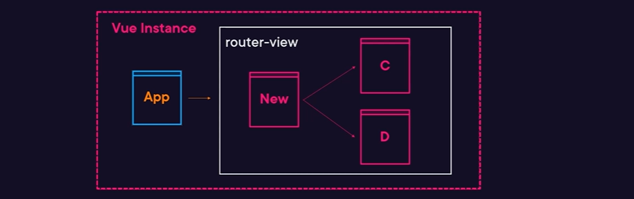

# VUE 3

Una vue istance (app) si crea usando la funzione createApp passandogli il root component e montandola su un elemento html:



```typescript
// in main.js
import { createApp } from "vue";

// root app component
import App from "./App.vue";
// global component (non sono raccomandate...aumentano il bundle size)
import HomePage from "./components/HomePage.vue";

const app = createApp(App).mount("#app");
app.component("HomePage", HomePage);
```

## Installazione

Per creare un app si può usare:

- Vue CLI (basata su webpack)
  - vue-cli-service serve
  - vue-cli-service build
- create-vue (basata su vite):
  - vite ( per sviluppo) tramite `npm run dev`
  - vite build (per produzione) tramite tramite `npm run build`

```bash
# si installa il tool
> npm install create-vue -g

# si crea l'app, rispondendo nome dell'app
# se si vuole typescript, jsx support, vue router, pinia, E2E testing, eslint, prettier, etc
> create-vue      #
```

all'interno di vite.config.js ci stanno tutte le configurazioni

## Componenti

In un "Single file Components" con estensione .vue è possibile avere logica, template e stile. I file .vue devono essere compilati tramite build tools.

```javascript

// OPTION API
<script>
    import HomePage from './components/HomePage.vue';

    export default {
        name: 'App',
        components: {
            HomePage // registrato localmente
        },
        props:{
            msg:String
        },
        created(){
            this.getData()
        },
        data(){
            return {
                carta:[],
                addToCart: false
            }
        },
        methods:{
            etc
        }
    }
</script>

<template></template>
<style scoped></style>
```

con la composition API (abbiamo una composisizione di function) abbiamo:

```javascript

// COMPOSITION API
<script setup>
    import {onCreated} from 'vue';

    let addedToCart = false;
    let cart = [],

    onCreated(()=>{
        this.getData();
    })
</script>
```

## Template syntax

```html
<template>
  <div>
    
  </div>

  <!-- Text Interpolation Options -->
  <span> {{ msg }} </span>
  <span v-text="msg"></span>
  <!-- Setting Inner HTML -->
  <span v-html="rawHTML"></span>
  <!-- Can use JS Expressions; NOT JS Statements -->
  <span> {{ msg.reverse() }} </span>

  <!-- 
    v-if Puts el in DOM if true
v-else-if Like a usual conditional
v-else Like a usual conditional
v-show Toggles display CSS value
v-text Sets the inner text
v-html Sets the inner HTML
v-for Loop through an array/obj
v-on or @ Listens to DOM events
v-bind or : Reactive updates attribute
v-model Two way data binding
v-once Sets val once; Never update 
-->

  <!-- CONDITIONAL RENDERING Add/Remove Element from DOM w/ Boolean -->
  <div v-if="date == today">...</div>
  <div v-else-if="!done">...</div>
  <div v-else>...</div>

  <!-- Toggles display CSS instead of editing DOM -->
  <div v-show="date == today">...</div>

  <!-- HANDLING EVENTS Capture and event and call a method -->
  <div v-on:click="count">Increase</div>
  <!-- SHORTHAND -->
  <div @click="count">Increase</div>

  <!-- Method is passed a Native DOM Cvent
const count = (event) => {
console.log(event.target)
}
Event modifiers (usage: v-on:click.stop)
.stop Stops event propagation
.once Can only trigger event once
.prevent Calls evt.preventDefault
.self Don't send if target = child -->

  <!--  LIST RENDERING Basic Loop Over Array -->
  <li v-for="item in items" :key="item">{{ item }}</li>
  <!-- Loop and Track Index -->
  <li v-for="(item, index) in items">{{ index }} : {{ item }}</li>

  <!-- Use Objects to Bind Class/Styles -->
  <input :class="{error: hasError}" />
  <input :style='{margin: space+"px"}' />
</template>
```

# Composition API

`ref(initial-value)` modifica delle primitive (stringhe, numeri, booleani) in effettivi oggetti il cui valore è accessibile tramite .value, quindi quando si utilizza nel codice ref e computed si deve accedere al valore tramite .value!!!

Per non primitive (oggetti o array) si possono utilizzare sia `ref()` che `reactive()`. Nel secondo caso per prendere il valore non si deve usare .value nel codice JS!!!!.
NOTA BENE: (Per omogeneità di codice è meglio usare ref e computed invece che reactive per non dover stare a pensare dove mettere il .value).

E' possibile avere tutta la logica di un componente ritornata da un composable come sotto:


oppure più leggibile:


## Reattività


Da notare che sia con ref che con reactive non si deve cambiare il riferimento alla variabile iniziale cioè ad esempio non si può fare questo (perchè filter dà un nuovo array...e rompe la reattività):


mentre con reactive si deve usare il metodo slice che muta l'oggetto iniziale così:


o usare ref che tramite il set del .value modifica direttamente il valore e dà maggiore flessibilità:


## Life Cycle Hooks

La setup function sostituisce il precedente hook `created` e `beforeCreated` e viene fatta girare una sola volta quando il componente è creato. Quando il componente è montato in html si usa `onMounted`.
Da notare che tutte le composition function stanno all'inizio della setup function ma se all'interno di queste sono passate delle proprietà reattive anche queste sono rieseguite.

```html
// COMPOSITION API
```

Facciamo un esempio di 3 composable ed un componente che li usa tutti e tre:


ed i tre composables:


notare come le cose sono in cascata, prima si prendono tutti gli item, poi si cerca in base ad un input, poi si filtrano i risultati ricercati e poi si paginano quest'ultimi...

## Styling VUE Component

All'interno del tag `<style>` è possibile includere stile GLOBALE, ma se mettiamo `<style scoped>` allora lo stile è relativo al solo componente e NON verrà tramandato ai componenti figli a patto che non avvenga il normale comportamento a cascata del CSS (in css ad esempio il font color è ereditatao ma il border no!). In pratica Vue aggiunge dei data-attribute ad ogni singolo elemento contenuto dentro un componente.

NOTA BENE: è possibile avere all'interno di un Single file component entrambi gli stili globali e locali con due style tag uno scoped e l'altro no!.

Se vogliamo specificare che una classe di un padre deve essere applicata anche dei figli (o a figli di figli) allora si applica la sintassi `>>>` (o se con qualche preprocessor non funziona come .sass o .less allora si usa `/deep/` ) dove si indica nel css del padre che si vuole intervenire anche su classi che stanno su child components:

```css
.parent-class >>> .child-class {
  width: 100%;
}
```

### Conditional styling

```html
  <!-- Use Objects to Bind Class/Styles -->
    <input class="my-class" :class="{error: hasError}" />
    <input class="my-class" :class="[hasError? 'error' : '']" />
    <input  :class="[hasError? 'error' : '', 'my-class']" />


  <input :style='{margin: space+"px", backgroundColor : red}' />
  <input :style="{margin: space+"px", 'background-color' : red}" />
  <input :style="headBorderStyle" />  computed poperties
  <input :style="[headBorderStyle, anotherBorderStyle]" />  computed poperties
</template>

<script setup>
    const headBorderStyle = computed(()=> ({
        border: somevalue? '1px solid red' : '3px solid #aaa'
        'font-color': somevalue? 'red' : '#aaa'
    }))
<script/>
```

oppure si può fare il binding anche nel css:

```css
.box {
  width: 100%;
  min-height: 200px;
  border 3px, solid v-bind(headBorderStyle.fontColor)
}
```

Il fatto che si utilizzino le computed properties implica che la funzione sia cachata quindi non avviene come per Angular che la funzione è sparata n volte.

### Preprocessori

se vogliamo aggiungere SASS allora si devono installare il loader appropiato tramite

```bash
> npm install sass-loader sass
```

mettendo poi il riferimento tramite attributo dello style tag:

```html
<style scoped lang="scss"></style>
```

## Communication between vue components

Esempio di componente root

```html
<script setup>
  import { ref } from "vue";
  import { computed } from "vue";

  // local component used in template
  import Comp from "./Comp.vue";

  const msg = ref("Hello World!");
  const counter = ref(0);

  const alteredText = computed(() => {
    return msg.value + " modified";
  });

  const handleEvent = (evt) => {
    console.log("Handling event: ", evt);
    counter.value += 1;
  };

  const changeText = () => {
    msg.value = msg.value + " was changed!";
  };
</script>

<template>
  <h1>{{ msg }}</h1>
  <h3>Computed: {{ alteredText }}</h3>
  <input v-model="msg" />
  <button @click="changeText">Change text</button>
  <Comp :msg="msg" :counter="counter" @fireEvent="handleEvent" />
</template>
```

esempio di componente child

```html
<script setup>
  import { watch, computed } from "vue";

  import { useAppStore } from "./store";

  const { itemStore } = useAppStore();
  const selectedItem = computed(() => itemStore.getters.selectedItem);

  const prop = defineProps({
    msg: String,
    counter: {
      type: Number,
      default: 0,
    },
  });

  const emit = defineEmits(["fire-event"]);

  function emitEvent() {
    emit("fire-event", { payload: "changed from event" });
  }

  // what
  watch(
    () => prop.msg,
    (newVal, oldVal) => {
      console.log("Prop changed: ", newVal, oldVal);
    }
  );
</script>

<template>
  <div v-if="msg" class="comp">
    <h4>{{msg}} from Child component</h4>
    <h6>Counter {{counter}}</h6>
    <p>Has been selected: {{selectedItem}}</p>
    <button @click="emitEvent">Fire</button>
  </div>
</template>

<style scoped>
  .comp {
    margin-top: 1rem;
    padding: 0.5rem;
    border: 1px solid grey;
  }
</style>
```

## State management

```js
// store.js
<script setup>
import { onMounted, ref } from 'vue'
import { computed } from 'vue';

import { useAppStore } from './store';

// local component used in template
import Comp from './Comp.vue'

const { itemStore } = useAppStore()
// const { actions: itemStoreActions, getters: itemGetters } = itemStore
const items = computed(() => itemStore.getters.items)
const loading = computed(() => itemStore.getters.loading)


const msg = ref('Hello World!')
const counter = ref(0);

const alteredText = computed(() => {
  return msg.value + ' modified';
});

const handleEvent = (evt) => {
  console.log('Handling event: ', evt)
  counter.value += 1;
};

const changeText = () => {
  msg.value = msg.value + ' was changed!'
};

onMounted(() => {
  itemStore.actions.loadItems()
})

</script>

<template>
  <div v-if="loading">
    Loading items......
  </div>
  <div v-else>
    <h1>{{ msg }}</h1>
    <h3>Computed: {{ alteredText }}</h3>
    <input v-model="msg">
    <button @click="changeText">Change text</button>
    <Comp :msg="msg" :counter="counter" @fireEvent="handleEvent" />
  </div>
  <div>
    <div v-for='(item, index) in items' style="display:flex; justify-content: space-between">
      <h1>{{ item.name }}</h1>
      <button @click="itemStore.actions.selectItem(item.id)">selec itemt</button>
    </div>
  </div>
</template>
```

```typescript
// Items.ts
import { reactive } from "vue";

const itemsStore = reactive({
  loading: false,
  items: [],
  selectedItem: null,
});

const actions = {
  loadItems: async () => {
    itemsStore.loading = true;
    setTimeout(() => {
      itemsStore.loading = false;
      itemsStore.items = [
        { id: 1, name: "Lorenzo", selected: false },
        { id: 2, name: "Luigi", selected: false },
        { id: 3, name: "Mario", selected: false },
      ];
    }, 1000);
  },
  selectItem: (id) => {
    itemsStore.selectedItem = itemsStore.items.find((item) => item.id === id);
  },
};

const getters = {
  get loading() {
    return itemsStore.loading;
  },
  get items() {
    return itemsStore.items;
  },
  get selectedItem() {
    return itemsStore.selectedItem;
  },
};

export function useItemStore() {
  return { getters, actions };
}

// store.ts
import { useItemStore } from "./Items";

export function useAppStore() {
  return {
    itemStore: useItemStore(),
    // other store
  };
}
```

Oppure con store tra loro comunicanti:

```typescript
// loading.ts
import { reactive } from "vue";

const loadingStore = reactive({
  loading: false,
});

const actions = {
  setLoading: (how) => (loadingStore.loading = how),
};

const getters = {
  get loading() {
    return loadingStore.loading;
  },
};

export function useLoader() {
  return { actions, getters };
}

// Items.ts
import { reactive } from "vue";

import { useLoader } from "./loading";
const { actions: loaderActions } = useLoader();

const itemsStore = reactive({
  items: [],
  selectedItem: null,
});

const actions = {
  loadItems: async () => {
    loaderActions.setLoading(true);
    setTimeout(() => {
      loaderActions.setLoading(false);
      itemsStore.items = [
        { id: 1, name: "Lorenzo", selected: false },
        { id: 2, name: "Luigi", selected: false },
        { id: 3, name: "Mario", selected: false },
      ];
    }, 1000);
  },
  selectItem: (id) => {
    itemsStore.selectedItem = itemsStore.items.find((item) => item.id === id);
  },
};

const getters = {
  get items() {
    return itemsStore.items;
  },
  get selectedItem() {
    return itemsStore.selectedItem;
  },
};

export function useItemStore() {
  return { getters, actions };
}

// store.js
import { useItemStore } from "./Items";
import { useLoader } from "./loading";

export function useAppStore() {
  return {
    itemStore: useItemStore(),
    loaderStore: useLoader(),
  };
}
```
